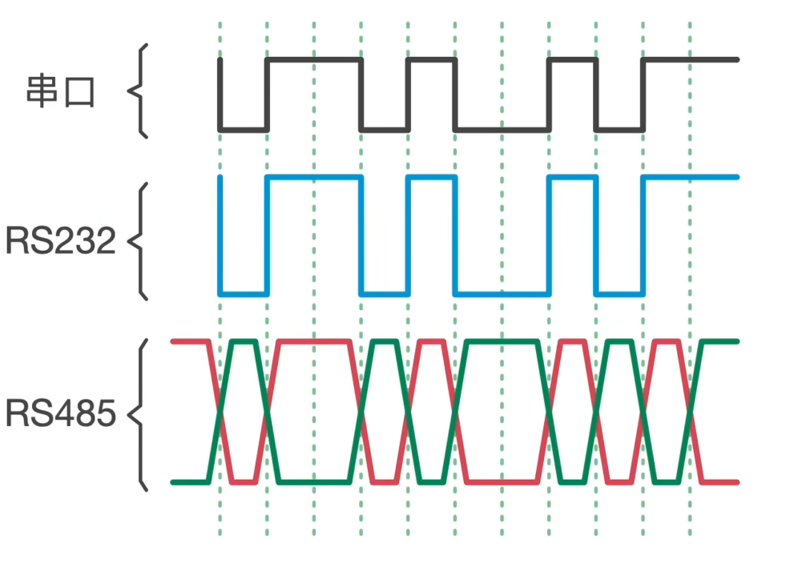
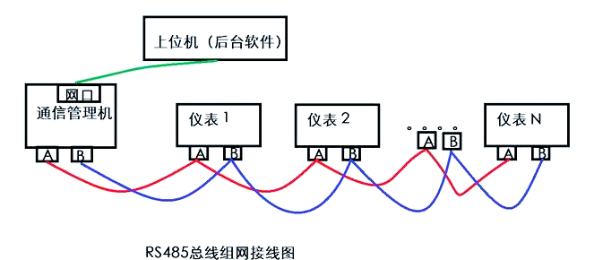

串口 RS232 RS485 都是物理层标准 

其中RS232使用较高差异的电平(±3-12v)区分逻辑 结构简单 用在芯片之间通讯 或在1m以内的PLC与上位机通讯 

RS485使用差分信号区分逻辑(如A>B为逻辑0 反之为1) 使用缠绕双绞线以抗干扰 传输距离可以在1200m 半双工！

上位机编程一般直接根据串口逻辑进行(使用通用串口总线) 

ModBus链路

一个项目中还可能有多条 同一链路上使用相同波特率 以实现轮询/问答

仪表要配置 站地址(站号) 通讯参数(波特率 校验 数据位 停止位)