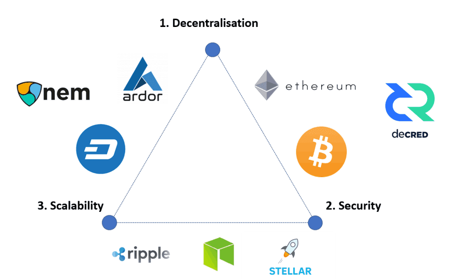

去中心化 安全

比特币以没有意义的耗时复杂运算（工作量证明PoW）竞争新区块的记账权 即挖矿过程

94年出生的维塔利克 被比特币吸引 加入到比特币交流的圈子 受其启发 提出结合图灵完备语言 实现基于区块链的基础建设 即以太坊的概念 
2015年以太坊第一版。 

> 以太坊整合智能合约平台的数字货币网络，其转换了区块链应用开发的思维模式，对底层区块链技术进行了封装，降低了区块链应用的开发难度。开发人员可以借助智能合约完成各种业务，包括但不限于金融交易、众筹、公司管理、知识产权管理等。

不可能三角： 去中心化 -- 可扩展性 -- 安全性

DAO(Decentralized Autonomous Organization)去中心化自治组织

DApp(Decentralized Application)去中心化应用 包括金融 社交 游戏 NFT等

DeFi(Decentralized Finance)去中心化金融

NFT(Non-Fungible Tokens)非同质化资产