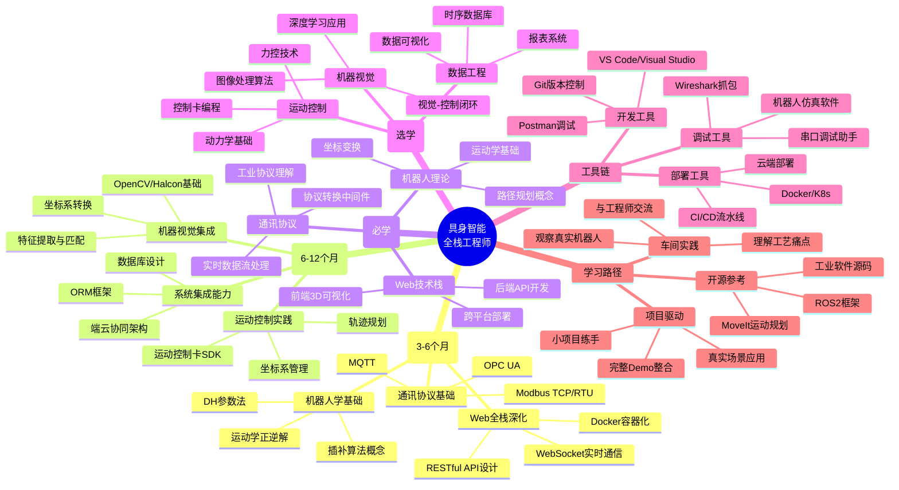

具身智能 Embodied Artificial Intelligence 不仅仅是人工智能+机器人， 而是人工智能通过物理本体与环境交互实现知行合一

智能闭环核心要素：

+ 具身本体:协作机械臂 四足/轮臂复合/人形机器人 无人驾驶汽车/无人机

+ 智能内核 依托大模型 世界模型 多模态技术
+ 环境交互 以第一人称视角与现实物理世界进行动态交互和自适应学习

现阶段人形机器人从业公司运营路径：

+ 软硬件全栈 从AI大脑到硬件躯体全自主研发 通过技术闭环提升软硬协同能力 代表：Figure AI、智元机器人
+ 重硬件 核心优势在本体设计 运动控制算法 代表：宇树
+ 重软件 Physical Intelligence、Field AI、银河通用

