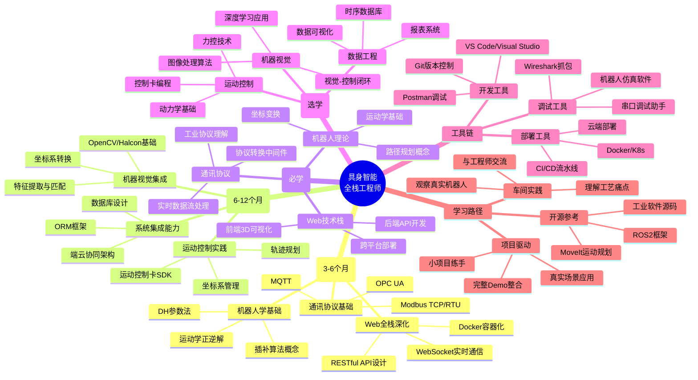

具身智能 Embodied Artificial Intelligence 不仅仅是人工智能+机器人， 而是人工智能通过物理本体与环境交互实现知行合一

智能闭环核心要素：

+ 具身本体:协作机械臂 四足/轮臂复合/人形机器人 无人驾驶汽车/无人机

+ 智能内核 依托大模型 世界模型 多模态技术
+ 环境交互 以第一人称视角与现实物理世界进行动态交互和自适应学习

现阶段人形机器人从业公司运营路径：

+ 软硬件全栈 从AI大脑到硬件躯体全自主研发 通过技术闭环提升软硬协同能力 代表：Figure AI、智元机器人
+ 重硬件 核心优势在本体设计 运动控制算法 代表：宇树
+ 重软件 Physical Intelligence、Field AI、银河通用


## 工业数字孪生 / 机器人可视化学习路线

> 目标角色：懂工业系统、会可视化、能做交互的复合型工程师。
>
> 推荐定位：**工业数字孪生 / 机器人可视化工程师**。

本路线的主线是：

> 看懂工业系统数据流，并能把机器人、PLC、相机、算法、工作流状态，用 3D 和实时 UI 表达出来。

```text
阶段 1：看懂系统
架构 / 数据流 / 通信协议 / 设备抽象

阶段 2：做出可视化
3D 场景 / 实时状态 / WebSocket / 设备面板

阶段 3：接近现场
机器人动作 / PLC 信号 / 相机帧 / workflow 编排

阶段 4：形成作品
数字孪生看板 / 机器人调试台 / 产线运行 HMI
```

应用软件工程师 -> 机器人应用工程师 -> 工业数字孪生/机器人可视化工程师

工艺流程（本质是finite state machine）数据流 应用开发
      ↓
机器人数据 仿真 可视化
      ↓
系统整合 复杂系统表达

这些title尽量不要作为长期目标：

❌ 纯WPF工程师
❌ 传统MIS/后台系统开发
❌ 只写流程脚本的“工具人”

工业软件的本质： 数据采集 状态控制 实时性是与互联网软件的最大区别

## 工业系统知识自测

| 维度        | 评价 |
| --------- | -- |
| 软件工程意识    | B  |
| 系统稳定性意识   | B  |
| 工业系统理解    | C  |
| 通信/实时系统   | C- |
| 3D空间理解    | B+ |
| 机器人运动理解潜力 | B  |
| 系统架构思维    | C+ |
| 工业可视化潜力   | A- |

### 重要欠缺

#### 1 工业通信

可能出现：

读写竞争
UI阻塞
状态撕裂

所以真实系统里会有：

缓冲区
消息队列
Dispatcher
事件总线

#### 2 设备抽象

工业设备的本质是状态机, 多设备协调本质是多状态机协同

```grapg
Idle
Running
Waiting
Error
EmergencyStop
```

状态之间 是转移、事件、异常回复

#### 3 数据流思维

```graph
PLC
→ 通信层
→ 设备模型
→ 状态机
→ UI
→ 3D场景
```

## 团队的生态位

系统层工程师，把整个系统串起来的人

机器人是： 机械 + 电气 + 控制 + AI + 软件 + 空间系统 的综合体。

系统设计解决的问题

+ 各部分边界和状态
+ 数据的生产、流经、消费、同步
+ 状态机：状态 变化 异常恢复