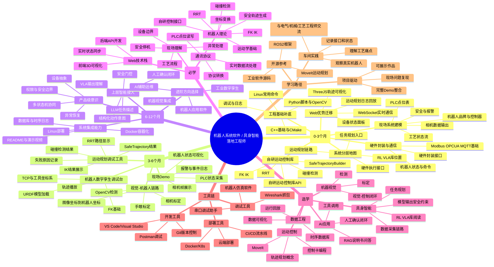

<!-- graph-links:start
[[EAI-hardwares|extends]]
[[VLA|extends]]
[[ROS|extends]]
graph-links:end -->

具身智能 Embodied Artificial Intelligence 不仅仅是人工智能+机器人， 而是人工智能通过物理本体与环境交互实现知行合一

智能闭环核心要素：

+ 具身本体:协作机械臂 四足/轮臂复合/人形机器人 无人驾驶汽车/无人机
+ 智能内核 依托大模型 世界模型 多模态技术
+ 环境交互 以第一人称视角与现实物理世界进行动态交互和自适应学习

挑战

+ sim-to-real gap 如硬件公差 环境误差 引起的累积误差
+ 数据的稀疏性 和 昂贵的试错 如自动驾驶的意外情况
+ 泛化能力
+ 安全性和不可解释性

现阶段人形机器人从业公司运营路径：

+ 软硬件全栈 从AI大脑到硬件躯体全自主研发 通过技术闭环提升软硬协同能力 代表：Figure AI、智元机器人
+ 重硬件 核心优势在本体设计 运动控制算法 代表：宇树
+ 重软件 Physical Intelligence、Field AI、银河通用

## 基于真实情况的路线判断

当前事实：

+ 已经参与工业机器人项目
+ 有机会接触真实机器人、PLC、相机
+ 项目有关联 RL / VLA 库，但现阶段还没有真正落地
+ 自研运动控制库包含 FK、IK、碰撞检测、RRT、SafeTrajectoryBuilder
+ C++、Python、Linux 有接触，但实际熟练度较低
+ 没有开发过产品级机器人/工业软件
+ 当前职责还不清晰，个人更想广泛接触整个系统
+ 可以接受 title 或薪资阶段性下降

结论：

当前项目不是传统上位机项目，而是有“上层智能库 + 自研运动规划/控制底座 + 硬件执行接口”的机器人系统。最短路径不是直接冲“VLA/强化学习算法工程师”，而是先把这条系统链路看懂，并把中层运动规划与落地层硬件执行转化为可证明的工程能力。

推荐定位：

> Web/应用软件工程师 -> 机器人系统软件工程师 -> 具身智能落地 / 机器人平台 / 运动规划可视化工程师

学习原则：

+ 每个知识点都要绑定真实对象：机器人、PLC点位、相机帧、坐标系、状态机、报警、日志
+ 不只写学习笔记，要沉淀现场图、数据流图、接口表、状态转移图、最小可运行Demo
+ C++、Python、Linux 不需要先追求算法竞赛式熟练，而要先达到能读SDK、写调用示例、调接口、看日志、部署Demo
+ 机器视觉应提前进入主线，因为光学背景是差异化优势
+ 当前项目主线是自研运动控制库和硬件封装接口，ROS2 作为开源生态参考和求职加分项，不作为现场项目主线
+ RL / VLA 是上层智能能力，现阶段作为系统分层认知和后续接入方向，不作为近期主要产出
+ 个人职责不清晰时，先做系统地图和调试工具，争取成为“看得懂全链路、能把问题定位清楚”的系统型工程师


## 机器人系统软件 / 具身智能落地学习路线

> 目标角色：懂机器人系统分层、能读运动规划链路、会做调试工具和可视化、能把上层智能接到安全执行链路的复合型工程师。
>
> 推荐定位：**机器人系统软件 / 具身智能落地 / 运动规划可视化工程师**。

本路线的主线是：

> 看懂 RL/VLA 上层库、自研运动规划库、硬件封装接口、PLC、相机、工作流状态之间的关系，并能把运动规划、轨迹、安全约束和现场状态用 3D 和实时 UI 表达出来。

```text
阶段 1：看懂系统
RL/VLA库位置 / 自研运动控制库 / 硬件接口 / PLC点位 / 相机输出

阶段 2：做出可视化
FK/IK / 碰撞检测 / RRT路径 / SafeTrajectory / WebSocket / 事件日志

阶段 3：接近现场
机器人动作 / PLC信号 / 相机帧 / workflow编排 / 异常恢复 / 安全门控

阶段 4：形成作品
运动规划调试台 / 机器人数字孪生 / 视觉引导Demo / LLM辅助运维
```

应用软件工程师 -> 机器人系统软件工程师 -> 具身智能落地/机器人平台/运动规划可视化工程师

工艺流程（本质是finite state machine）数据流 应用开发
      ↓
运动规划 安全轨迹 硬件执行 可视化
      ↓
上层智能接入 系统整合 复杂系统表达

这些title尽量不要作为长期目标：

❌ 纯WPF工程师
❌ 传统MIS/后台系统开发
❌ 只写流程脚本的“工具人”
❌ 短期直接包装成VLA/强化学习/人形机器人控制算法工程师

工业软件的本质： 数据采集 状态控制 实时性是与互联网软件的最大区别

## 工业系统知识自测

| 维度 | 当前评价 | 说明 |
| --- | --- | --- |
| Web/应用软件工程 | A- | 11年经验是核心资产 |
| 工业项目现场机会 | B | 已参与项目且能接触机器人、PLC、相机 |
| 产品级机器人/工业软件经验 | C- | 尚未独立交付过产品级软件 |
| C++/Python/Linux | C- | 有接触，但需要项目化补强 |
| 工业通信/PLC | C | 需要从点位表、读写、报警、状态模型开始 |
| 自研运动控制库/硬件接口 | C+ | 当前项目主线，包含 FK/IK/碰撞/RRT/SafeTrajectoryBuilder，需要从API、命令、状态、异常入手 |
| RL/VLA库关联理解 | C- | 项目有关联但未落地，先理解位置、输入输出、未来如何接入 |
| ROS2/开源机器人框架 | C- | 作为开源生态参考和求职加分项，不替代当前项目主线 |
| 机器视觉/光学基础 | B | 光学背景有优势，但需要OpenCV/标定/手眼项目证明 |
| 3D空间理解和可视化 | B+ | 适合作为差异化作品方向 |
| 机器人运动理解 | C+ | 已开始学习FK/IK/TCP，但还需要Demo验证 |
| 系统架构与状态机思维 | B | 和Web架构经验可迁移 |
| 运动规划可视化潜力 | A- | 当前最值得主打的方向 |
| 系统全局接触意愿 | A | 想广泛接触整个系统，但需要一个纵向作品承接 |

### 重要欠缺

#### 1 工业通信

可能出现：

读写竞争
UI阻塞
状态撕裂

所以真实系统里会有：

缓冲区
消息队列
Dispatcher
事件总线

学习产物：

+ 一份真实或脱敏的PLC点位表
+ 一个Modbus/OPC UA/MQTT模拟采集Demo
+ 一个设备状态面板
+ 一份异常与报警状态表

#### 2 设备抽象

工业设备的本质是状态机, 多设备协调本质是多状态机协同

```text
Idle
Running
Waiting
Error
EmergencyStop
```

状态之间是转移、事件、异常恢复

#### 3 数据流思维

```text
PLC
→ 通信层
→ 设备模型
→ 状态机
→ UI
→ 3D场景
```

#### 4 工程语言和Linux

当前不是缺少“会不会刷题”，而是缺少能在工业现场稳定调试的工程熟练度。

优先补：

+ Linux文件、进程、服务、日志、网络排查
+ Python脚本、OpenCV、接口测试、数据处理
+ C++基础、CMake、动态库、SDK调用、硬件接口封装
+ Git分支、README、构建脚本、部署说明

#### 5 自研运动规划库

这是当前项目中最有含金量的中层能力，不应只把它当作黑盒 SDK。

需要拆清楚：

+ FK：关节角如何变成 TCP 位姿
+ IK：目标位姿如何变成关节解，失败原因是什么
+ 碰撞检测：障碍物、机器人模型、工作空间如何表示
+ RRT：在哪些场景触发，路径如何采样和筛选
+ SafeTrajectoryBuilder：如何把候选路径变成可执行安全轨迹
+ 硬件接口：轨迹如何下发，状态如何反馈，异常如何回滚

学习产物：

+ 运动控制库 API 输入输出表
+ 规划失败原因表
+ 轨迹生成流程图
+ 一版运动规划调试/可视化工具

#### 6 视觉和坐标系

光学背景要转化成机器人项目价值，需要补齐：

+ 相机内参、畸变、外参
+ 手眼标定 AX=XB
+ 图像坐标、相机坐标、机器人基坐标、TCP坐标
+ 检测结果如何进入机器人动作流程

#### 7 上层智能库

RL / VLA 库目前有关联但未落地，所以近期不要把它当成主要产出。

正确读法：

+ 它在系统里属于上层智能或策略层
+ 需要看它输出的是自然语言、动作意图、目标位姿、轨迹片段还是策略参数
+ 它的输出必须经过结构化、约束检查、安全门控和人工确认
+ 真正执行仍要进入运动规划库和硬件接口

近期目标不是训练 VLA，而是理解：

```text
LLM/VLA输出
→ 结构化任务
→ 安全检查
→ 运动规划
→ 轨迹执行
→ 状态反馈
```

## T 型能力路线

横向广度：

```text
RL/VLA
→ 任务规划
→ 运动规划
→ 碰撞检测
→ 安全轨迹
→ 硬件接口
→ PLC/相机
→ UI/日志/回放
```

纵向深度：

> 运动规划调试台 / SafeTrajectoryBuilder Inspector

这个纵向作品最适合当前背景：既能承接 Web3D 和工程化经验，又能深入 FK/IK、碰撞、RRT、安全轨迹和硬件状态。

## 12个月作品路线

### 0-3个月：系统链路地图与运动库接口表

目标：看懂 RL/VLA 库、自研运动控制库、硬件接口、PLC、相机之间的边界。

产物：

+ 设备拓扑图
+ 系统分层图
+ 自研运动控制库 API 输入输出表
+ PLC点位表
+ 机器人状态字段表
+ 相机数据输出表
+ 运动规划失败原因表

面试价值：

证明自己不是只会前端页面，而是能读懂机器人系统链路和运动规划接口。

### 3-6个月：运动规划调试台

目标：把 FK/IK、碰撞检测、RRT、SafeTrajectoryBuilder 的结果放进一个可交互工具。

产物：

+ URDF/简化模型加载
+ FK/IK结果展示
+ 碰撞检测结果显示
+ RRT路径展示
+ SafeTrajectory生成结果
+ TCP和坐标系显示
+ 轨迹播放和失败日志

面试价值：

证明Web3D能力能迁移到机器人运动规划和调试工具，而不是普通后台系统。

### 6-12个月：视觉与上层智能接入Demo

目标：完成从相机或上层智能任务到机器人安全执行的最小闭环。

产物：

+ 相机标定记录
+ 手眼标定流程说明
+ OpenCV检测或识别
+ 坐标转换
+ LLM/VLA输出到结构化任务的接口说明
+ 安全检查和人工确认流程
+ PLC/机器人/相机/任务状态机
+ Demo视频和README

面试价值：

证明光学背景、视觉算法、上层智能、运动规划和软件工程能组合成一个完整系统。

## 团队的生态位

系统层工程师，把整个系统串起来的人

机器人是： 机械 + 电气 + 控制 + AI + 软件 + 空间系统 的综合体。

系统设计解决的问题

+ 各部分边界和状态
+ 数据的生产、流经、消费、同步
+ 状态机：状态 变化 异常恢复
