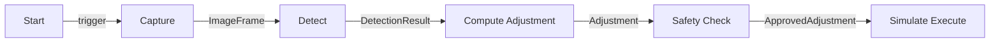
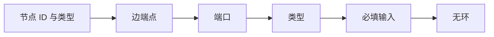
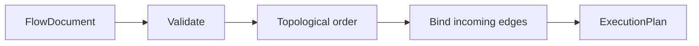

## 这篇要解决什么问题

我熟悉 TypeScript、组件状态和异步调用，但第一次看 Flow Graph 时，容易被 DAG、typed port、拓扑排序、barrier 等术语同时淹没。

这篇只解决一个小问题：**如何把一组有类型的 TypeScript 函数，组织成一张能在运行前校验、按依赖顺序执行、并留下 trace 的图。**

我们用一个虚构的工业视觉流程贯穿全文：

```text
启动 -> 模拟采集图像 -> 模拟缺陷检测 -> 计算调整量 -> 安全检查 -> 模拟执行
```

所有数据都是固定 fixture，不连接相机、PLC 或机器人。最终产物是一个最小批式 DAG 执行器，不是假装已经可用于生产的设备控制系统。

## 1. 先用熟悉的 TypeScript 理解端口

先不谈图。下面是普通函数调用：

```ts
function detect(frame: ImageFrame): DetectionResult {
  return { frameId: frame.frameId, defectFound: true, score: 0.92 };
}
```

可以把 Flow Graph 中的概念理解成：

| Flow Graph | 熟悉的 TypeScript 概念 |
|---|---|
| node（节点） | 函数 |
| input port（输入端口） | 有类型的函数参数 |
| output port（输出端口） | 有类型的返回值 |
| edge（边） | 把一个函数的返回值传给另一个函数 |

如果 `capture` 输出 `ImageFrame`，`detect` 输入也要求 `ImageFrame`，这条边可以连接。若把 `DetectionResult` 接到要求 `trigger` 的端口，就像把对象传给只接收布尔信号的函数，应该在运行前报错。

图比手写函数调用多做四件事：

1. **校验**：端口、类型和必填输入是否正确。
2. **调度**：根据依赖计算执行顺序。
3. **观察**：记录哪个节点成功、失败和耗时。
4. **持久化**：把节点和边保存成 JSON，而不是把流程写死在调用栈中。

## 2. DAG、数据流图和状态机不是一回事

“都是方框和连线”不代表运行语义相同。

| 模型 | 边表示什么 | 业务数据在哪里 | 是否允许环 |
|---|---|---|---|
| DAG 工作流 | 先做 A，再做 B | 常放在共享 context | 否 |
| Typed dataflow | A 的某个输出端口给 B 的某个输入端口 | 沿有类型的边传递 | 顶层通常不允许 |
| 状态机 | 满足条件后从状态 A 转到状态 B | 状态对象 | 通常允许 |

本文做的是 **typed dataflow（有类型的数据流图）**，同时把顶层限制为 DAG（Directed Acyclic Graph，有向无环图）。

判断一张图是否真正表达了 typed dataflow，可以问：

- 边是否精确连接到端口，而不只是连接节点？
- 端口是否声明数据类型？
- 下游是否直接消费上游产物，而不是从全局对象里猜变量名？
- 图加载时能否发现类型错误和漏接输入？

## 3. 本文要实现的工业视觉流程



示例数据固定为：

- 图像编号：`frame-001`。
- 缺陷分数：`0.92`。
- 建议调整量：`0.6 mm`。
- 允许的最大调整量：`2 mm`。

这里的 safety check 只是解释数据流和 fail-closed（条件不满足就拒绝继续）的最小示例，不代表真实机器人系统只需要比较一个数值。

## 4. 初始化实验目录

以下代码按 Node.js 24 编写，利用其直接运行可擦除 TypeScript 类型的能力：

```bash
mkdir flow-graph-lab
cd flow-graph-lab
npm init -y
npm pkg set type=module
npm install -D typescript @types/node
mkdir -p src/flow
```

创建 `tsconfig.json`：

```json
{
  "compilerOptions": {
    "target": "ES2022",
    "module": "NodeNext",
    "moduleResolution": "NodeNext",
    "strict": true,
    "noEmit": true,
    "allowImportingTsExtensions": true
  },
  "include": ["src/**/*.ts"]
}
```

相对 import 显式带 `.ts` 后缀，既能通过上述配置检查，也能由 Node 24 直接执行。

## 5. 定义图、节点、端口和边

新建 `src/flow/types.ts`：

```ts
export type PortDataType =
  | "trigger"
  | "image_frame"
  | "detection"
  | "adjustment"
  | "approved_adjustment";

export interface ImageFrame {
  frameId: string;
  width: number;
  height: number;
}

export interface DetectionResult {
  frameId: string;
  defectFound: boolean;
  score: number;
}

export interface Adjustment {
  frameId: string;
  offsetMm: number;
}

export interface ApprovedAdjustment extends Adjustment {
  approved: true;
}

export interface PortDefinition {
  id: string;
  dataType: PortDataType;
  required?: boolean;
}

export interface FlowNode {
  id: string;
  type: string;
  config: Record<string, unknown>;
}

export interface FlowEdge {
  id: string;
  from: { node: string; port: string };
  to: { node: string; port: string };
}

export interface FlowDocument {
  schemaVersion: 1;
  id: string;
  name: string;
  nodes: FlowNode[];
  edges: FlowEdge[];
}

export type PortValues = Record<string, unknown>;

export interface RunContext {
  runId: string;
  signal: AbortSignal;
  log(message: string, fields?: Record<string, unknown>): void;
}

export interface NodeDefinition {
  type: string;
  inputs: PortDefinition[];
  outputs: PortDefinition[];
  run(
    inputs: PortValues,
    config: Record<string, unknown>,
    context: RunContext,
  ): Promise<PortValues>;
}

export function isTypeCompatible(
  output: PortDataType,
  input: PortDataType,
): boolean {
  return output === input;
}
```

这里刻意没有 `any`。示例规模小，先要求类型完全相等，能更清楚地观察类型校验的价值。

`RunContext` 只保存运行控制和日志能力，不用来传 `ImageFrame` 等业务数据。业务数据沿边传递，才能看清来源和去向。

## 6. 用注册表统一节点契约

图实例只保存节点 ID、节点类型和配置。某种节点有哪些端口、如何运行，由注册表统一定义。

新建 `src/flow/registry.ts`：

```ts
import type { NodeDefinition } from "./types.ts";

export class NodeRegistry {
  private readonly definitions = new Map<string, NodeDefinition>();

  register(definition: NodeDefinition): this {
    if (this.definitions.has(definition.type)) {
      throw new Error(`node type already registered: ${definition.type}`);
    }
    this.definitions.set(definition.type, definition);
    return this;
  }

  get(type: string): NodeDefinition | undefined {
    return this.definitions.get(type);
  }

  require(type: string): NodeDefinition {
    const definition = this.get(type);
    if (!definition) throw new Error(`unknown node type: ${type}`);
    return definition;
  }
}
```

再新建 `src/flow/example-nodes.ts`。这些节点全部使用固定数据，只用于模拟：

```ts
import { NodeRegistry } from "./registry.ts";
import type {
  Adjustment,
  ApprovedAdjustment,
  DetectionResult,
  ImageFrame,
  NodeDefinition,
} from "./types.ts";

function objectInput(value: unknown, name: string): Record<string, unknown> {
  if (typeof value !== "object" || value === null) {
    throw new Error(`${name} must be an object`);
  }
  return value as Record<string, unknown>;
}

const start: NodeDefinition = {
  type: "start",
  inputs: [],
  outputs: [{ id: "trigger", dataType: "trigger" }],
  async run() {
    return { trigger: true };
  },
};

const capture: NodeDefinition = {
  type: "capture",
  inputs: [{ id: "trigger", dataType: "trigger", required: true }],
  outputs: [{ id: "frame", dataType: "image_frame" }],
  async run(_inputs, config) {
    if (typeof config.frameId !== "string") {
      throw new Error("capture.config.frameId must be a string");
    }
    const frame: ImageFrame = {
      frameId: config.frameId,
      width: 1280,
      height: 1024,
    };
    return { frame };
  },
};

const detect: NodeDefinition = {
  type: "detect",
  inputs: [{ id: "frame", dataType: "image_frame", required: true }],
  outputs: [{ id: "detection", dataType: "detection" }],
  async run(inputs, config) {
    const frame = objectInput(inputs.frame, "detect.frame");
    if (typeof frame.frameId !== "string") {
      throw new Error("detect.frame.frameId must be a string");
    }
    if (typeof config.defectFound !== "boolean" || typeof config.score !== "number") {
      throw new Error("detect config is invalid");
    }
    const detection: DetectionResult = {
      frameId: frame.frameId,
      defectFound: config.defectFound,
      score: config.score,
    };
    return { detection };
  },
};

const computeAdjustment: NodeDefinition = {
  type: "compute_adjustment",
  inputs: [{ id: "detection", dataType: "detection", required: true }],
  outputs: [{ id: "adjustment", dataType: "adjustment" }],
  async run(inputs, config) {
    const detection = objectInput(inputs.detection, "compute_adjustment.detection");
    if (typeof detection.frameId !== "string" || typeof config.offsetMm !== "number") {
      throw new Error("compute_adjustment input or config is invalid");
    }
    const adjustment: Adjustment = {
      frameId: detection.frameId,
      offsetMm: detection.defectFound === true ? config.offsetMm : 0,
    };
    return { adjustment };
  },
};

const safetyCheck: NodeDefinition = {
  type: "safety_check",
  inputs: [{ id: "adjustment", dataType: "adjustment", required: true }],
  outputs: [{ id: "approved", dataType: "approved_adjustment" }],
  async run(inputs, config) {
    const adjustment = objectInput(inputs.adjustment, "safety_check.adjustment");
    if (typeof adjustment.frameId !== "string" ||
        typeof adjustment.offsetMm !== "number" ||
        typeof config.maxOffsetMm !== "number") {
      throw new Error("safety_check input or config is invalid");
    }
    if (Math.abs(adjustment.offsetMm) > config.maxOffsetMm) {
      throw new Error("adjustment rejected by safety check");
    }
    const approved: ApprovedAdjustment = {
      frameId: adjustment.frameId,
      offsetMm: adjustment.offsetMm,
      approved: true,
    };
    return { approved };
  },
};

const simulateExecute: NodeDefinition = {
  type: "simulate_execute",
  inputs: [{ id: "adjustment", dataType: "approved_adjustment", required: true }],
  outputs: [],
  async run(inputs, _config, context) {
    const adjustment = objectInput(inputs.adjustment, "simulate_execute.adjustment");
    if (adjustment.approved !== true) {
      throw new Error("simulate_execute requires an approved adjustment");
    }
    context.log("simulation only: no hardware command sent", {
      frameId: adjustment.frameId,
      offsetMm: adjustment.offsetMm,
    });
    return {};
  },
};

export function createExampleRegistry(): NodeRegistry {
  return new NodeRegistry()
    .register(start)
    .register(capture)
    .register(detect)
    .register(computeAdjustment)
    .register(safetyCheck)
    .register(simulateExecute);
}
```

注册表是契约的单一真源：校验器读取端口，执行器读取 runner，将来编辑器也可以据此生成节点面板。

## 7. 在运行前校验图

可靠 Flow Graph 的第一价值不是拖线，而是把错误从“设备运行到一半”提前为“图加载失败”。



新建 `src/flow/validate.ts`：

```ts
import type { NodeRegistry } from "./registry.ts";
import { isTypeCompatible } from "./types.ts";
import type { FlowDocument, PortDefinition } from "./types.ts";

export class GraphValidationError extends Error {
  readonly issues: string[];

  constructor(issues: string[]) {
    super(`invalid flow graph:\n${issues.map((issue) => `- ${issue}`).join("\n")}`);
    this.issues = issues;
  }
}

function findPort(
  ports: PortDefinition[],
  portId: string,
): PortDefinition | undefined {
  return ports.find((port) => port.id === portId);
}

export function validateGraph(
  graph: FlowDocument,
  registry: NodeRegistry,
): void {
  const issues: string[] = [];
  const seenNodeIds = new Set<string>();

  for (const node of graph.nodes) {
    if (seenNodeIds.has(node.id)) issues.push(`duplicate node id: ${node.id}`);
    seenNodeIds.add(node.id);
    if (!registry.get(node.type)) issues.push(`unknown node type: ${node.type}`);
  }

  const nodes = new Map(graph.nodes.map((node) => [node.id, node]));
  const incomingCount = new Map<string, number>();

  for (const edge of graph.edges) {
    const source = nodes.get(edge.from.node);
    const target = nodes.get(edge.to.node);

    if (!source) {
      issues.push(`edge ${edge.id} references missing source node ${edge.from.node}`);
      continue;
    }
    if (!target) {
      issues.push(`edge ${edge.id} references missing target node ${edge.to.node}`);
      continue;
    }

    const sourceDefinition = registry.get(source.type);
    const targetDefinition = registry.get(target.type);
    if (!sourceDefinition || !targetDefinition) continue;

    const output = findPort(sourceDefinition.outputs, edge.from.port);
    const input = findPort(targetDefinition.inputs, edge.to.port);

    if (!output) {
      issues.push(`${source.id} has no output port ${edge.from.port}`);
      continue;
    }
    if (!input) {
      issues.push(`${target.id} has no input port ${edge.to.port}`);
      continue;
    }
    if (!isTypeCompatible(output.dataType, input.dataType)) {
      issues.push(
        `type mismatch: ${source.id}.${output.id}(${output.dataType}) -> ` +
        `${target.id}.${input.id}(${input.dataType})`,
      );
    }

    const inputKey = `${target.id}.${input.id}`;
    incomingCount.set(inputKey, (incomingCount.get(inputKey) ?? 0) + 1);
  }

  for (const node of graph.nodes) {
    const definition = registry.get(node.type);
    if (!definition) continue;
    for (const input of definition.inputs) {
      if (input.required && (incomingCount.get(`${node.id}.${input.id}`) ?? 0) === 0) {
        issues.push(`required input is unconnected: ${node.id}.${input.id}`);
      }
    }
  }

  issues.push(...detectCycle(graph));

  if (issues.length > 0) throw new GraphValidationError(issues);
}

function detectCycle(graph: FlowDocument): string[] {
  const indegree = new Map(graph.nodes.map((node) => [node.id, 0]));
  const outgoing = new Map(graph.nodes.map((node) => [node.id, [] as string[]]));

  for (const edge of graph.edges) {
    if (!indegree.has(edge.from.node) || !indegree.has(edge.to.node)) continue;
    indegree.set(edge.to.node, (indegree.get(edge.to.node) ?? 0) + 1);
    outgoing.get(edge.from.node)?.push(edge.to.node);
  }

  const queue = graph.nodes
    .map((node) => node.id)
    .filter((nodeId) => indegree.get(nodeId) === 0);
  let visited = 0;

  while (queue.length > 0) {
    const nodeId = queue.shift();
    if (!nodeId) break;
    visited += 1;
    for (const targetId of outgoing.get(nodeId) ?? []) {
      const next = (indegree.get(targetId) ?? 0) - 1;
      indegree.set(targetId, next);
      if (next === 0) queue.push(targetId);
    }
  }

  return visited === graph.nodes.length
    ? []
    : ["graph contains a cycle"];
}
```

前端可以在拖线时立即检查类型，改善体验；运行端仍必须重新校验，因为 JSON 也可能来自文件、CLI 或旧版本客户端。

## 8. 编译为静态执行计划

图只在加载时变化，执行器不必每次都扫描所有边和重复计算顺序。编译阶段完成两件事：

1. 用 Kahn 算法得到稳定的拓扑顺序。
2. 把每个节点的入边预先绑定好。



新建 `src/flow/compile.ts`：

```ts
import type { NodeRegistry } from "./registry.ts";
import type { FlowDocument, FlowEdge } from "./types.ts";
import { validateGraph } from "./validate.ts";

export interface ExecutionPlan {
  graph: FlowDocument;
  order: string[];
  incomingByNode: Map<string, FlowEdge[]>;
}

export function compileGraph(
  graph: FlowDocument,
  registry: NodeRegistry,
): ExecutionPlan {
  validateGraph(graph, registry);

  const indegree = new Map(graph.nodes.map((node) => [node.id, 0]));
  const outgoing = new Map(graph.nodes.map((node) => [node.id, [] as string[]]));
  const incomingByNode = new Map(
    graph.nodes.map((node) => [node.id, [] as FlowEdge[]]),
  );

  for (const edge of graph.edges) {
    indegree.set(edge.to.node, (indegree.get(edge.to.node) ?? 0) + 1);
    outgoing.get(edge.from.node)?.push(edge.to.node);
    incomingByNode.get(edge.to.node)?.push(edge);
  }

  const queue = graph.nodes
    .map((node) => node.id)
    .filter((nodeId) => indegree.get(nodeId) === 0);
  const order: string[] = [];

  while (queue.length > 0) {
    const nodeId = queue.shift();
    if (!nodeId) break;
    order.push(nodeId);
    for (const targetId of outgoing.get(nodeId) ?? []) {
      const next = (indegree.get(targetId) ?? 0) - 1;
      indegree.set(targetId, next);
      if (next === 0) queue.push(targetId);
    }
  }

  return { graph, order, incomingByNode };
}
```

“编辑是 Flow，执行是静态计划”并不矛盾。Flow 是用户看见和保存的语义；静态计划是运行端为了确定性和效率生成的内部结构。

## 9. 实现确定性执行器

执行器按计划依次运行节点，把上游输出放入目标输入端口，并记录最小 trace。

新建 `src/flow/executor.ts`：

```ts
import type { ExecutionPlan } from "./compile.ts";
import type { NodeRegistry } from "./registry.ts";
import type { PortValues, RunContext } from "./types.ts";

export interface TraceEvent {
  nodeId: string;
  status: "running" | "success" | "failed";
  durationMs?: number;
  error?: string;
}

export interface RunResult {
  outputs: Map<string, unknown>;
  trace: TraceEvent[];
}

function outputKey(nodeId: string, portId: string): string {
  return `${nodeId}.${portId}`;
}

export class FlowExecutor {
  private readonly plan: ExecutionPlan;
  private readonly registry: NodeRegistry;

  constructor(
    plan: ExecutionPlan,
    registry: NodeRegistry,
  ) {
    this.plan = plan;
    this.registry = registry;
  }

  async run(context: RunContext): Promise<RunResult> {
    const nodes = new Map(this.plan.graph.nodes.map((node) => [node.id, node]));
    const outputs = new Map<string, unknown>();
    const trace: TraceEvent[] = [];

    for (const nodeId of this.plan.order) {
      if (context.signal.aborted) throw new Error(`run ${context.runId} cancelled`);

      const node = nodes.get(nodeId);
      if (!node) throw new Error(`compiled node is missing: ${nodeId}`);
      const definition = this.registry.require(node.type);
      const inputs: PortValues = {};

      for (const edge of this.plan.incomingByNode.get(nodeId) ?? []) {
        const key = outputKey(edge.from.node, edge.from.port);
        if (!outputs.has(key)) throw new Error(`upstream output is missing: ${key}`);
        inputs[edge.to.port] = outputs.get(key);
      }

      const startedAt = performance.now();
      trace.push({ nodeId, status: "running" });

      try {
        const result = await definition.run(inputs, node.config, context);
        for (const port of definition.outputs) {
          if (!(port.id in result)) {
            throw new Error(`declared output is missing: ${nodeId}.${port.id}`);
          }
          outputs.set(outputKey(nodeId, port.id), result[port.id]);
        }
        trace.push({
          nodeId,
          status: "success",
          durationMs: performance.now() - startedAt,
        });
      } catch (error) {
        const message = error instanceof Error ? error.message : String(error);
        trace.push({
          nodeId,
          status: "failed",
          durationMs: performance.now() - startedAt,
          error: message,
        });
        throw new Error(`node ${nodeId} failed: ${message}`, { cause: error });
      }
    }

    return { outputs, trace };
  }
}
```

这个版本刻意顺序执行。先把输入收集、错误传播和结果可重复做正确，再讨论并行与流式，否则很难判断错误来自基础语义还是并发调度。

## 10. 运行完整示例

新建 `src/main.ts`：

```ts
import { compileGraph } from "./flow/compile.ts";
import { createExampleRegistry } from "./flow/example-nodes.ts";
import { FlowExecutor } from "./flow/executor.ts";
import type { FlowDocument, RunContext } from "./flow/types.ts";

const graph: FlowDocument = {
  schemaVersion: 1,
  id: "vision-inspection-demo",
  name: "Vision Inspection Demo",
  nodes: [
    { id: "start", type: "start", config: {} },
    { id: "capture", type: "capture", config: { frameId: "frame-001" } },
    { id: "detect", type: "detect", config: { defectFound: true, score: 0.92 } },
    { id: "adjust", type: "compute_adjustment", config: { offsetMm: 0.6 } },
    { id: "gate", type: "safety_check", config: { maxOffsetMm: 2 } },
    { id: "execute", type: "simulate_execute", config: {} },
  ],
  edges: [
    { id: "e1", from: { node: "start", port: "trigger" }, to: { node: "capture", port: "trigger" } },
    { id: "e2", from: { node: "capture", port: "frame" }, to: { node: "detect", port: "frame" } },
    { id: "e3", from: { node: "detect", port: "detection" }, to: { node: "adjust", port: "detection" } },
    { id: "e4", from: { node: "adjust", port: "adjustment" }, to: { node: "gate", port: "adjustment" } },
    { id: "e5", from: { node: "gate", port: "approved" }, to: { node: "execute", port: "adjustment" } },
  ],
};

const registry = createExampleRegistry();
const executor = new FlowExecutor(compileGraph(graph, registry), registry);
const context: RunContext = {
  runId: "run-001",
  signal: new AbortController().signal,
  log(message, fields) {
    console.log(message, fields ?? {});
  },
};

const result = await executor.run(context);
console.log("detection", result.outputs.get("detect.detection"));
console.log("approved", result.outputs.get("gate.approved"));
console.log(
  "order",
  result.trace
    .filter((event) => event.status === "success")
    .map((event) => event.nodeId),
);
```

运行：

```bash
node src/main.ts
```

输出重点如下：

```text
simulation only: no hardware command sent { frameId: 'frame-001', offsetMm: 0.6 }
detection { frameId: 'frame-001', defectFound: true, score: 0.92 }
approved { frameId: 'frame-001', offsetMm: 0.6, approved: true }
order [ 'start', 'capture', 'detect', 'adjust', 'gate', 'execute' ]
```

## 11. 用测试锁定行为

新建 `src/flow/flow.test.ts`：

```ts
import assert from "node:assert/strict";
import test from "node:test";
import { compileGraph } from "./compile.ts";
import { createExampleRegistry } from "./example-nodes.ts";
import { FlowExecutor } from "./executor.ts";
import { NodeRegistry } from "./registry.ts";
import type { FlowDocument, NodeDefinition, RunContext } from "./types.ts";
import { GraphValidationError, validateGraph } from "./validate.ts";

function createGraph(): FlowDocument {
  return {
    schemaVersion: 1,
    id: "vision-inspection-demo",
    name: "Vision Inspection Demo",
    nodes: [
      { id: "start", type: "start", config: {} },
      { id: "capture", type: "capture", config: { frameId: "frame-001" } },
      { id: "detect", type: "detect", config: { defectFound: true, score: 0.92 } },
      { id: "adjust", type: "compute_adjustment", config: { offsetMm: 0.6 } },
      { id: "gate", type: "safety_check", config: { maxOffsetMm: 2 } },
      { id: "execute", type: "simulate_execute", config: {} },
    ],
    edges: [
      { id: "e1", from: { node: "start", port: "trigger" }, to: { node: "capture", port: "trigger" } },
      { id: "e2", from: { node: "capture", port: "frame" }, to: { node: "detect", port: "frame" } },
      { id: "e3", from: { node: "detect", port: "detection" }, to: { node: "adjust", port: "detection" } },
      { id: "e4", from: { node: "adjust", port: "adjustment" }, to: { node: "gate", port: "adjustment" } },
      { id: "e5", from: { node: "gate", port: "approved" }, to: { node: "execute", port: "adjustment" } },
    ],
  };
}

test("executes the industrial vision flow in deterministic order", async () => {
  const registry = createExampleRegistry();
  const plan = compileGraph(createGraph(), registry);
  const executor = new FlowExecutor(plan, registry);
  const logs: string[] = [];
  const context: RunContext = {
    runId: "run-001",
    signal: new AbortController().signal,
    log(message) { logs.push(message); },
  };

  const result = await executor.run(context);

  assert.deepEqual(
    result.trace.filter((event) => event.status === "success").map((event) => event.nodeId),
    ["start", "capture", "detect", "adjust", "gate", "execute"],
  );
  assert.deepEqual(result.outputs.get("detect.detection"), {
    frameId: "frame-001",
    defectFound: true,
    score: 0.92,
  });
  assert.deepEqual(result.outputs.get("gate.approved"), {
    frameId: "frame-001",
    offsetMm: 0.6,
    approved: true,
  });
  assert.deepEqual(logs, ["simulation only: no hardware command sent"]);
});

test("rejects incompatible port types", () => {
  const graph = createGraph();
  graph.edges[1] = {
    id: "bad-type",
    from: { node: "detect", port: "detection" },
    to: { node: "capture", port: "trigger" },
  };

  assert.throws(
    () => validateGraph(graph, createExampleRegistry()),
    (error) => error instanceof GraphValidationError &&
      error.issues.some((issue) => issue.includes("type mismatch")),
  );
});

test("rejects an unconnected required input", () => {
  const graph = createGraph();
  graph.edges = graph.edges.filter((edge) => edge.to.node !== "detect");

  assert.throws(
    () => validateGraph(graph, createExampleRegistry()),
    (error) => error instanceof GraphValidationError &&
      error.issues.includes("required input is unconnected: detect.frame"),
  );
});

test("rejects an unknown port", () => {
  const graph = createGraph();
  graph.edges[1] = {
    id: "bad-port",
    from: { node: "capture", port: "missing" },
    to: { node: "detect", port: "frame" },
  };

  assert.throws(
    () => validateGraph(graph, createExampleRegistry()),
    (error) => error instanceof GraphValidationError &&
      error.issues.includes("capture has no output port missing"),
  );
});

test("rejects a cycle", () => {
  const loop: NodeDefinition = {
    type: "loop",
    inputs: [{ id: "in", dataType: "trigger", required: true }],
    outputs: [{ id: "out", dataType: "trigger" }],
    async run() { return { out: true }; },
  };
  const registry = new NodeRegistry().register(loop);
  const graph: FlowDocument = {
    schemaVersion: 1,
    id: "cycle",
    name: "Cycle",
    nodes: [
      { id: "a", type: "loop", config: {} },
      { id: "b", type: "loop", config: {} },
    ],
    edges: [
      { id: "ab", from: { node: "a", port: "out" }, to: { node: "b", port: "in" } },
      { id: "ba", from: { node: "b", port: "out" }, to: { node: "a", port: "in" } },
    ],
  };

  assert.throws(
    () => validateGraph(graph, registry),
    (error) => error instanceof GraphValidationError &&
      error.issues.some((issue) => issue.includes("cycle")),
  );
});
```

运行类型检查和测试：

```bash
npx tsc
node src/flow/flow.test.ts
```

五个测试分别证明：正常链路顺序稳定、类型错误会被拒绝、必填输入不能漏接、端口名不能写错、顶层图不能有环。

## 12. 当前版本没有解决什么

这个执行器已经形成 `schema -> validate -> compile -> execute -> trace` 闭环，但它仍然只是最小批式 DAG：

- 没有 branch 的 `skipped` 语义。
- 没有并行执行和 fan-in barrier 的运行时状态。
- 没有多消息流、有界队列和 backpressure（背压）。
- 没有 timeout、retry 和真实 I/O 的取消传播。
- 没有运行时 payload schema，只校验端口声明的类型名称。
- 没有任何真实设备能力。

这些不是“少写几段代码”的问题，而是需要先定义清楚运行语义。下篇会逐项拆开。

## 验收与下一步

完成本文后，应能独立回答：

1. typed edge 相比共享黑板解决了什么问题？
2. 为什么前端拖线校验不能替代运行端校验？
3. 为什么图要先编译再反复运行？
4. `RunContext` 为什么不应该承载主要业务数据？
5. 当前执行器为什么还不能连接真实机器人？

练习：

1. 增加重复 edge ID 校验，并写一个失败测试。
2. 增加无硬件能力的 `manual_review` 节点，输出人工确认结果。
3. 为 `ImageFrame` 和 `DetectionResult` 增加运行时 payload 校验。

这份最小实现能证明 typed dataflow、图校验和确定性调度的基础能力。它对工业可视化、机器人应用软件和系统集成岗位有价值，但不证明真实设备调试或运动控制能力。

下一篇：
