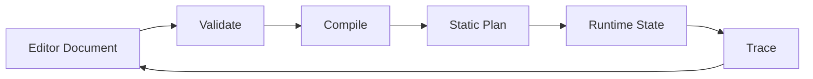
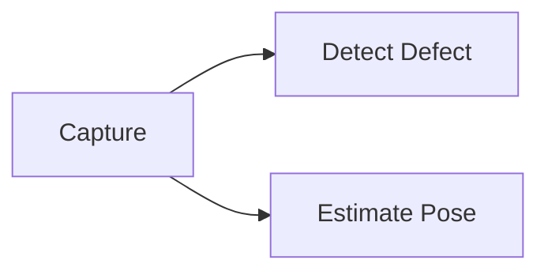
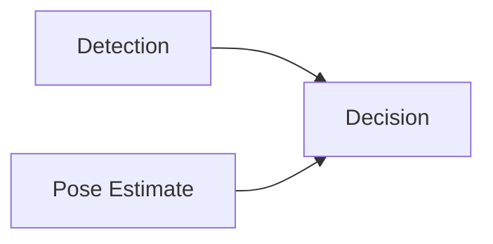
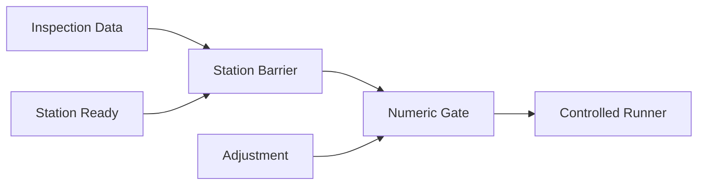

## 这篇解决什么问题

上篇：

上篇已经得到一条可运行的最小链路：

```text
schema -> validate -> compile -> execute -> trace
```

但工业视觉和机器人应用软件还会遇到更难的问题：画布如何保存完整语义、一帧一帧的数据如何流动、下游变慢时如何限制上游，以及一个名字叫 `execute` 的节点为什么不能自动获得真实硬件能力。

这篇不再复制一套完整代码，而是建立下一阶段的工程边界。重点是：

- React Flow 只是编辑器，不是运行时。
- 流式不是“拓扑排序执行得快一点”。
- 能自由拖线，不代表能自由获得设备副作用。
- 工业安全必须由运行端能力和 fail-closed 规则保证。

## 1. 先回顾上篇的边界

上篇的执行器是**确定性的批式 DAG**：一张图运行一次，每个节点运行一次，下游等上游产出后继续。

它已经能证明：

- 边精确连接端口。
- 端口类型在加载期检查。
- 必填输入不能漏接。
- 顶层图不能有环。
- 图先编译，再按稳定顺序运行。

它还不能表达：

- 一个 source 连续产生多帧。
- branch 未选中的路径如何标记。
- 多个上游何时算“到齐”。
- 队列满时上游该等待、丢弃还是降采样。
- 什么条件满足后才允许真实设备动作。

接下来不是给现有 `for` 循环不断加 `if`，而是逐项定义这些语义。

## 2. React Flow 只负责编辑，不定义运行语义

React Flow 的 handle 很适合表示端口。关键是保存时不能把端口信息压扁成 `A -> B`。

```ts
import type { Edge, Node } from "@xyflow/react";

interface FlowEdge {
  id: string;
  from: { node: string; port: string };
  to: { node: string; port: string };
}

function toFlowEdge(edge: Edge): FlowEdge {
  if (!edge.sourceHandle || !edge.targetHandle) {
    throw new Error(`edge ${edge.id} must connect explicit ports`);
  }
  return {
    id: edge.id,
    from: { node: edge.source, port: edge.sourceHandle },
    to: { node: edge.target, port: edge.targetHandle },
  };
}
```

对应关系必须直接、可逆：

```text
sourceHandle -> 输出端口 ID
targetHandle -> 输入端口 ID
```

节点坐标不影响执行，应单独保存：

```ts
interface EditorMetadata {
  positions: Record<string, { x: number; y: number }>;
  viewport?: { x: number; y: number; zoom: number };
}

interface EditorDocument {
  graph: FlowDocument;
  metadata: EditorMetadata;
}
```

拖线时的类型校验只是体验优化。后端或本地 runtime 仍要重新校验，因为 JSON 可能来自文件、CLI、测试 fixture 或旧客户端。

## 3. 编辑模型、编译模型和运行模型

把三种模型塞进一个巨大对象，往往会让 UI 状态、持久化格式和临时运行状态互相污染。

```text
编辑模型：节点配置、端口边、坐标、分组和注释
编译模型：拓扑顺序、直接边绑定和资源引用
运行模型：消息 handle、节点状态、取消信号和 trace
```



### Flow 编辑不等于运行时必须创建重型消息系统

端口图是语义层。单进程执行时，可以在加载期把边解析为直接绑定：

```text
detect.detection -> adjust.detection
```

运行时只需要拿到已绑定的上游输出并调用 runner，不必每个节点都查全局表，也不必为低频 DAG 引入分布式 broker。

图像和点云也不应沿边复制本体。端口消息传 `FrameHandle` 或引用，实际数据由资源存储管理：

```ts
interface FrameHandle {
  frameId: string;
  kind: "image_2d" | "point_cloud";
}
```

选择这种分离的代价是：schema 变更时要同时考虑编辑文档迁移和编译器兼容，不能靠一个对象“到处都能用”来逃避版本治理。

## 4. Fan-out、fan-in、barrier 和 branch

这几个术语经常同时出现，最好逐个定义。

### Fan-out：一个输出发给多个下游



若 payload 很大，两个下游应共享只读 handle，而不是各复制一份图像。

### Fan-in：多个上游汇入同一节点



fan-in 只描述结构，不自动说明节点何时执行。节点需要一个明确的等待规则。

### Barrier：等一组条件全部满足

例如 `decision` 必须同时收到 `DetectionResult` 和 `PoseEstimate`。在批式 DAG 中，required inputs 到齐即可运行；在流式系统中，还必须知道哪些消息属于同一个工件或同一帧。

关联键至少包含：

```text
(runId, itemId)
```

不能只按端口收集，否则可能把工件 A 的检测结果和工件 B 的位姿拼成一组。

### Branch：只激活一条路径

branch 的两个输出可以是 `pass` 和 `review`。未选中的路径应该标记为 `skipped`，不是 `failed`。

这三种状态不能混为一谈：

| 状态 | 含义 |
|---|---|
| missing | 本应有数据，但尚未到达或确实丢失 |
| skipped | 分支语义明确决定不执行 |
| failed | 节点尝试执行后出错 |

如果不显式区分，fan-in 节点很难判断应该继续等待、跳过还是报错。

## 5. 从批式 DAG 到流式 Flow

批式 DAG 的执行单位是“节点的一次运行”；流式 Flow 的执行单位是“消息的一次到达”。

| 维度 | 批式 DAG | 流式 Flow |
|---|---|---|
| 调度单位 | 节点 | 消息或 item |
| source 产出 | 一次结果 | 多次 emit |
| 完成条件 | 节点 Promise 完成 | 需要显式 end/complete |
| 内存风险 | 一次运行的数据 | 队列可能持续增长 |
| 背压 | 通常不明显 | 必须定义 |
| barrier | required 输入到齐 | 同一关联键的数据到齐 |

一种最小流式 runner 接口是：

```ts
interface OutputEvent {
  port: string;
  itemId: string;
  value: unknown;
}

interface StreamingNodeRunner {
  run(
    inputs: AsyncIterable<OutputEvent>,
    context: RunContext,
  ): AsyncIterable<OutputEvent>;
}
```

### Backpressure 不是性能优化，而是内存上界

假设相机每秒输出 30 帧，检测节点每秒只能处理 10 帧。若输入队列无限增长，系统只是把“处理不过来”延迟成“稍后内存耗尽”。

使用有界 channel 时，队列满后必须选择策略：

- `await`：让 producer 等待，适合不能丢数据的离线处理。
- `drop-oldest`：只保留新数据，适合实时预览。
- `sample`：按频率采样，适合监控界面。
- `reject`：明确失败，适合必须保证完整批次的流程。

策略属于业务契约，不能由底层队列随意决定。

### 实用升级顺序

1. 先让一个 source 能连续 emit。
2. 让一条线性链处理多消息。
3. 增加 end 信号和取消。
4. 增加有界队列和背压策略。
5. 再加 fan-out。
6. 最后实现按 `(runId, itemId)` 收集的 barrier。

不要一开始同时引入分支、循环、并行、流式和分布式执行。

## 6. 取消、超时、重试和 trace

### 取消必须传到真实 I/O

```ts
async function withTimeout<T>(
  operation: (signal: AbortSignal) => Promise<T>,
  timeoutMs: number,
  parentSignal: AbortSignal,
): Promise<T> {
  const controller = new AbortController();
  const timer = setTimeout(
    () => controller.abort(new Error(`timeout after ${timeoutMs}ms`)),
    timeoutMs,
  );
  const cancelFromParent = () => controller.abort(parentSignal.reason);
  parentSignal.addEventListener("abort", cancelFromParent, { once: true });

  try {
    return await operation(controller.signal);
  } finally {
    clearTimeout(timer);
    parentSignal.removeEventListener("abort", cancelFromParent);
  }
}
```

只在外层 `Promise.race()` 一个 timeout，会让调用方停止等待，却不一定停止底层 I/O。对设备动作而言，这是假取消：UI 显示已停止，设备请求仍可能继续。

### 重试要同时满足三个条件

1. 错误明确标记为 transient（暂时性故障）。
2. 操作幂等，或带稳定 idempotency key。
3. 重复执行不会制造额外物理副作用。

网络读取可能重试；机器人移动、PLC 写入和工艺派发不能默认重试。

### Trace 是统一的可观察性基础

至少记录：

```text
graphVersion, runId, nodeId, status, durationMs,
retryCount, runMode, input/output summary, errorCode
```

图像和点云只记录 handle、尺寸和摘要，不把整个 payload 写进日志。Trace 同时服务于节点高亮、性能分析、失败定位、运行回放和安全审计。

## 7. L1 原子节点与 L2 复合节点

L1（Level 1）原子节点只做一件事，例如：

- `capture`：产出 frame handle。
- `detect`：frame -> detection。
- `collect`：按关联键收集消息。
- `log`：输出摘要。

L2（Level 2）复合节点把常用链封装成一个外部契约，例如：

```text
InspectPart = capture -> detect -> aggregate
```

复合节点需要定义：

- 对外 typed ports。
- 外部端口到内部悬空端口的映射。
- config 如何传入内部节点。
- trace 默认折叠还是展开。
- 子图版本和依赖。

选择 L1/L2 分层的收益是：开发者可展开调试，操作员可使用更少、更贴近工艺概念的节点。代价是复合节点需要单独的版本、迁移和 trace 展示规则。

## 8. 六个值得保留的架构决议

下面把设计演进整理成六张决议卡。它们是通用工程结论，不依赖某个具体项目。

### 8.1 从隐式黑板到 typed edges

**背景问题**：节点通过字符串后缀、全局变量名或扫描共享对象寻找上游数据。图能运行，但数据依赖不在图上，错误通常到运行期才出现。

**考虑方案**：继续靠文档约定；统一显式变量名；让业务产物通过 typed edges 传递。

**最终选择**：业务数据沿 typed edges 传递；context 只保留 run ID、日志、取消信号等运行能力。

**理由**：依赖可见，端口可在加载期校验，多个相同类型的 source 也不会因命名猜测而冲突。

**代价**：需要维护端口 schema 和图迁移，旧的隐式数据引用不能自动继续工作。

### 8.2 编辑是 Flow，执行是编译后的静态计划

**背景问题**：直接让运行时解释画布对象，会不断扫描边、读取 UI 字段，并把展示状态带入执行逻辑。

**考虑方案**：运行时直接解释编辑 JSON；每次执行动态查找；加载时编译静态计划。

**最终选择**：保存完整端口图，加载时校验、拓扑排序并绑定边，运行时消费静态计划。

**理由**：编辑语义完整，同时减少运行时动态查找；确定性也更容易测试。

**代价**：编译模型需要缓存失效和版本管理，编辑后必须重新编译。

### 8.3 L1 原子节点与 L2 复合节点分层

**背景问题**：全用原子节点会让操作画布被大量胶水步骤淹没；全用大黑盒又难以组合和调试。

**考虑方案**：只保留原子节点；只提供固定流程；原子节点与用户可复用复合节点并存。

**最终选择**：L1 提供清晰、可测试的原子能力，L2 封装高频工艺和受控流程。

**理由**：兼顾组合能力和操作员认知负担，调试时还能展开内部链。

**代价**：复合节点的端口映射、版本和 trace 展开需要额外设计。

### 8.4 教学节点不等于真实硬件能力

**背景问题**：把 `register`、`adjust`、`execute` 做成可自由组合且都能真实运行的节点，可能允许用户绕过必要的安全判断。

**考虑方案**：相信画布连线正确；在每个节点重复安全逻辑；把真实能力收敛到受控复合节点和 runner。

**最终选择**：细粒度节点可用于 simulate、教学和 dry-run；真实纠偏通过受控复合节点调用单一 runner。

**理由**：安全边界不依赖 UI，不会因为多一种连法就出现第二条设备写入路径。

**代价**：模拟图和真实能力不完全一一对应，UI 必须明确标识哪些节点仅用于模拟。

### 8.5 工位 barrier 与数值 gate 正交

**背景问题**：数据齐全不代表设备已到位；设备到位也不代表调整量安全。

**考虑方案**：只设一个综合布尔值；只检查工位；分别建模两道门。

**最终选择**：工位 barrier 检查数据和设备状态，数值 gate 判断调整量，两者都通过才允许真实动作。

**理由**：两道门处理不同故障，失败原因可观察，也便于分别测试。

**代价**：运行状态更多，需要明确超时、错误码和操作员处理流程。

### 8.6 批量流程把计算与派发分开

**背景问题**：计算节点内部直接下发设备，会让中间产物无法预览、重放和统一审核，多项计算也难以在最终派发前叠加。

**考虑方案**：边算边发；每个调整节点自行下发；先计算全部调整，再通过 barrier 统一派发。

**最终选择**：纯计算节点产出新数据，受控派发节点执行副作用。

**理由**：中间结果可 trace、可 dry-run、可比较；批量数据齐备后再进入统一安全路径。

**代价**：需要保存中间产物，并处理它们的版本、生命周期和一致性。

## 9. Simulate、real 与能力注入

run mode 不是 UI 上的装饰开关，而是 runtime 的强制策略。

| Mode | Runner | Barrier | Numeric gate | Result |
|---|---|---|---|---|
| simulate | absent | any | any | run fixture only; no hardware |
| simulate | present | any | any | still simulate; no hardware |
| real | absent | any | any | fail-closed |
| real | present | not ready | any | fail-closed |
| real | present | ready | reject | fail-closed |
| real | present | ready | accept | controlled dispatch |

### 节点名称不是权限

图中出现 `execute`，不代表它天然能控制设备。真实副作用还必须同时满足：

```text
runMode == real
AND runner 已注入
AND barrier ready
AND numeric gate accept
```

runner 是 capability（能力）对象，只由应用装配层注入：

```ts
interface MotionRunner {
  dispatch(command: ApprovedCommand, signal: AbortSignal): Promise<void>;
}

interface RuntimeServices {
  motionRunner?: MotionRunner;
}
```

在 `simulate` 模式，即使 runner 存在也不能调用。`real` 模式缺 runner 必须拒绝，不能悄悄退化成“假成功”。

这种设计的代价是依赖注入和测试装配更复杂，但安全能力不会因节点配置或前端请求而凭空出现。

## 10. 两道正交的安全门

考虑“质检工位计算调整量，执行工位应用结果”的流程：



### 工位 barrier 检查

- 所需检测、位姿和调整数据是否属于同一 `runId/itemId`。
- 设备是否到达指定工位。
- 必需的握手信号是否在超时内满足。

### 数值 gate 检查

- 调整量是否在允许范围。
- 输入标定和坐标变换是否有效。
- 决策是 Apply、Skip、Clamp 还是 Reject。

真实 runner 不接受未经 gate 的原始调整量。更稳妥的做法是让类型也表达这一点：

```ts
interface GatedCommand {
  decision: "apply" | "clamp";
  effectiveOffsetMm: number;
  auditId: string;
}
```

fail-closed 的含义是：runner 缺失、barrier 未满足、gate 拒绝或状态无法确认时，结果都是“不执行真实动作”，同时留下可诊断错误，而不是猜测一个默认值继续。

## 11. 批量流程为什么要把计算与派发分开

工业视觉不总是拍一帧就立即动作。常见批量流程是：

```text
采集多视点
  -> 分别检测/配准
  -> 按 itemId 映射到目标工艺对象
  -> 汇总全部调整
  -> 工位 barrier
  -> 统一安全检查
  -> 批量派发
```

建议的数据形态：

```ts
interface PlannedAdjustment {
  itemId: string;
  targetId: string;
  offsetMm: number;
  sourceFrameId: string;
}

interface AdjustmentBatch {
  runId: string;
  items: PlannedAdjustment[];
}
```

计算节点只产生 `AdjustmentBatch`，不持有 runner。派发节点只接受经过映射、barrier 和 gate 的批次。

这样做可在派发前完成：

- 预览每个目标对应哪一帧、哪项调整。
- 检查是否漏项或重复映射。
- dry-run 比较调整前后的结果。
- 记录统一审计 trace。

代价是必须定义批次完成条件。若某帧永远不到，需要明确 timeout 后是整批失败、跳过该项还是进入人工确认，不能无限等待。

## 12. React Flow 编辑器的最小实现边界

第一版编辑器只需要做到六件事：

1. 从 registry 展示节点面板。
2. 根据 typed ports 渲染 handles。
3. 拖线时检查方向和类型。
4. 用 schema 驱动属性编辑。
5. 保存、加载完整 `FlowDocument + EditorMetadata`。
6. 把 trace 映射为节点状态和端口产物摘要。

状态展示应稳定，不因文案或图标改变节点尺寸：

| 状态 | 展示 |
|---|---|
| running | 高亮边框和当前输入 |
| success | 耗时、输出数量和摘要 |
| failed | 稳定错误码和错误位置 |
| skipped | 降低强调度并说明分支原因 |

不要在第一版加入多人协作、无限画布优化、自动布局市场、插件商店或真实设备控制。这些都不是验证 Flow 语义的必要条件。

## 工程验收清单

### 1. Typed graph editor

**交付物**：React Flow 节点面板、typed handles、拖线校验、保存加载和后端二次校验。

**验收**：错误类型不能连接；手改 JSON 后 runtime 仍能拒绝；保存再加载保持端口和配置不变。

**面试价值**：证明前端交互、schema 建模和执行契约能连成一个系统，而不只是画一张流程图。

### 2. Streaming frame demo

**交付物**：模拟相机连续产生 frame handle，检测节点较慢，有界队列提供可切换背压策略。

**验收**：长时间运行内存不随消息数无限增长；trace 能显示丢弃、等待或采样数量；取消后 source 和下游都停止。

**面试价值**：证明理解实时数据流、资源上界和可观察性，适合机器人应用软件与工业数据平台方向。

### 3. Simulate-only safety workflow

**交付物**：工位 barrier、数值 gate、run-mode 矩阵和审计 trace；runner 使用 mock，默认 simulate。

**验收**：缺 runner、barrier 未就绪或 gate 拒绝时均 fail-closed；任何测试都不能产生真实 I/O。

**面试价值**：证明能讨论工业副作用、权限边界和故障模式，而不是把“工作流执行”简化为函数调用。

## 对转型和面试的价值

这两篇最适合支撑以下定位：

- 工业数字孪生与机器人可视化工程师。
- 机器人应用软件工程师。
- 设备集成、HMI 和工业数据流方向。
- 工业视觉工作流与 AI 应用工程师。

它利用了已有的 TypeScript、前端交互和系统架构优势，同时补上图校验、调度语义、背压、trace 和工业安全边界。

需要保持职业表述克制：typed graph demo 和 simulate workflow 能证明系统软件思维，但不能证明实时控制、机器人全身控制、真实产线调试或商业机器人交付。要让能力更可信，下一步应补一段可运行演示视频、架构图、失败案例和测试报告。
