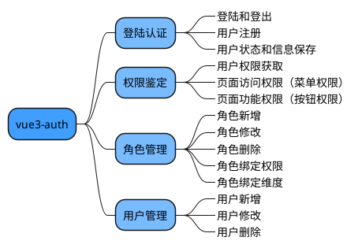

[plantuml](https://plantuml.com/zh/sequence-diagram)
preview in vscode：
+ 安装PlantUML插件 PlantUML Previewer插件
+ 配置 PlantUML Server
按Alt + D打开PlantUML Preview
generate through Hexo
#### 流程图



start
if(account cache exist?) then (no) 
    :return null; 
    stop
else (yes)  
    :start silent request;
    :get result or exceptions;
    :return result;
stop


```plantuml
start
:declare timer; CancellationTokenSource;
:declare TaskComplationSource;
if(account cache exist?) then (no) 
    :return null; 
    stop
else (yes)  
    :declare silentRequestTask, 
    input cancellation token;
    :parallel execuate silentRequestTask
    and TaskComplationSource.Task;
    fork
    :execuate silentRequestTask;
    fork again
    :TaskComplationSource.Task;
    end fork
    :when any task returns;
    if(silentRequestTask complete?) then(yes)
        :get result or exceptions;
        :return result;
        :release timer;
        :close error dialog if opened;
        stop
    else (no)
        :throw OperationCancelException;
        :set isAuthenticationCancel flag to true;
        :return null;
        stop
```


start
:declare timer; CancellationTokenSource;
:declare TaskComplationSource;
if(account cache exist?) then (no) 
    :return null; 
    stop
else (yes)  
    :declare silentRequestTask, 
    input cancellation token;
    :parallel execuate silentRequestTask
    and TaskComplationSource.Task;
    fork
    :execuate silentRequestTask;
    fork again
    :TaskComplationSource.Task;
    end fork
    :when any task returns;
    if(silentRequestTask complete?) then(yes)
        :get result or exceptions;
        :return result;
        :release timer;
        :close error dialog if opened;
        stop
    else (no)
        :throw OperationCancelException;
        :set isAuthenticationCancel flag to true;
        :return null;
        stop

#### 时序图
```plantuml
Main -> PubClientApplication
Main -> Timer
Loop loop description
    FileDialog -> FileManager: exportFile selectPath
    FileManager -> FileManager: CopyFileTo(exportFile, selectPath)
end
```

Main -> PubClientApplication
Main -> Timer
Loop loop description
    FileDialog -> FileManager: exportFile selectPath
    FileManager -> FileManager: CopyFileTo(exportFile, selectPath)
end

#### 思维导图


@startmindmap
*[#409EFF] vue3-auth
    **[#79bbff] 登陆认证
        ***_ 登陆和登出
        ***_ 用户注册
        ***_ 用户状态和信息保存
    **[#79bbff] 权限鉴定
        ***_ 用户权限获取
        ***_ 页面访问权限（菜单权限）
        ***_ 页面功能权限（按钮权限）
    **[#79bbff] 角色管理
        ***_ 角色新增
        ***_ 角色修改
        ***_ 角色删除
        ***_ 角色绑定权限
        ***_ 角色绑定维度
    **[#79bbff] 用户管理
        ***_ 用户新增
        ***_ 用户修改
        ***_ 用户删除
@endmindmap
