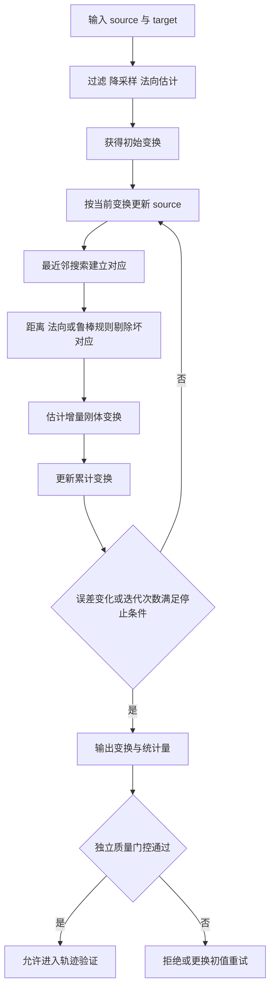

<!-- graph-links:start
[[MachineVision|relates]]
[[MedicalImageFormat|prerequisite]]
[[Kinematics|relates]]
graph-links:end -->

## 为什么写这篇文章

我曾在 iOS 口腔医疗项目中调用过 ICP 接口，将不同治疗时期的口腔 Mesh 对齐；在现在的工业软件工作中，我又接触到根据工件点云的 ICP、CPD 配准结果修正工艺轨迹。两段经历都涉及“配准”，但我主要是算法接口的使用者，没有参与底层算法开发。

这篇文章的目标不是把接口经验包装成算法研发经验，而是向下多走一层：

- 能说清楚配准在估计什么。
- 能解释 ICP 每一步为什么存在。
- 能区分刚性 ICP、非刚性 CPD 和其他常见算法的适用边界。
- 能用已知真值的数据完成一次可重复实验。
- 能判断配准结果是否足以用于轨迹纠偏，而不只看“模型似乎重合了”。

先给出一个核心判断：

> 口腔治疗前后的模型可能包含真实形变；正常工件的轨迹纠偏通常假定工件是刚体。两者都能使用点集配准技术，但变换模型和结果用途并不相同。

## 一、先分清 Mesh、点云与轨迹

### 1. Mesh

三角网格 Mesh 通常包含：

- 顶点坐标。
- 三角形的顶点索引。
- 可选的顶点法向、纹理坐标、颜色等属性。

STL 口腔模型和 CAD 三角化模型都属于 Mesh。Mesh 不只保存离散位置，还显式描述了表面的连接关系。

ICP 的经典输入是两个点集。对 Mesh 做 ICP 时，算法库常见的处理方式是：

1. 直接使用 Mesh 顶点。
2. 在三角形表面均匀采样点。
3. 采样点的同时计算表面法向量。

直接使用顶点并不一定合理，因为网格三角化密度可能很不均匀。某个区域顶点更密，会在距离目标函数中获得更高权重，而这未必符合业务目标。

### 2. 点云

点云至少是一组空间坐标：

```text
P = {p1, p2, ..., pn},  pi = [x, y, z]^T
```

它还可能包含：

- 法向量 `n = [nx, ny, nz]^T`。
- 颜色、反射强度或置信度。
- 时间戳、扫描线编号、传感器位姿。
- 语义类别或实例编号。

与 Mesh 相比，普通点云并不直接说明哪些点彼此相邻，也不保证采样均匀。点云算法必须从空间邻域中重新估计局部结构。

### 3. 轨迹不是一串 XYZ

工业机器人或加工设备中的轨迹点通常不只有位置，还包含工具姿态：

```text
pose = position + orientation
```

一个 TCP 位姿可以写成 4x4 齐次矩阵：

```text
T_frame_tcp =
[ R(3x3)  t(3x1) ]
[   0       1    ]
```

其中 `R` 是工具坐标系相对参考坐标系的旋转，`t` 是工具原点的位置。焊接、喷涂、打磨、涂胶等工艺往往对工具轴和表面法向的夹角敏感，所以轨迹纠偏不能只给 XYZ 加一个平移量。

## 二、配准问题究竟是什么

设有两个点集：

- **源点集 source**：准备被变换的数据。
- **目标点集 target**：希望源点集最终对齐到的参考。

配准要寻找一个变换 `T_target_source`，使源点变换后尽量靠近目标点：

```text
p_target = T_target_source * p_source
```

这篇文章统一采用：

- 列向量。
- 齐次坐标。
- 变换左乘。
- 矩阵下标写成 `T_目标坐标系_源坐标系`。

这套命名直接表达“把什么坐标变换到什么坐标”，比 `matrix1`、`offset` 或含义不清的 `registrationResult` 更不容易出错。

### 1. 刚性、仿射与非刚性变换

**刚性变换 rigid transformation** 只包含旋转和平移：

```text
p_target = R * p_source + t
```

它保持距离和角度不变，适合描述没有变形的工件在空间中的位姿变化。三维刚体有 6 个自由度：3 个旋转自由度和 3 个平移自由度。

**相似变换 similarity transformation** 在刚性变换上增加统一尺度 `s`。扫描数据出现尺度问题时可以用它诊断，但工业系统更应该先检查毫米、米等单位是否配置错误，而不是让算法随意缩放工件。

**仿射变换 affine transformation** 可以表达非均匀缩放和剪切，平行关系仍被保留，但长度和角度可能改变。

**非刚性变换 non-rigid transformation** 允许不同空间位置产生不同位移，适合描述软组织、治疗变化或材料形变。其结果通常不是一个 4x4 刚体矩阵。

### 2. 对应点、重叠和离群点

如果知道源点 `p_i` 在目标点集中对应哪个 `q_i`，刚体变换可以通过一组对应点估计。现实扫描通常没有现成对应关系，因此算法需要同时处理：

- **对应 correspondence**：哪些点代表相同表面位置。
- **重叠 overlap**：两个点集共同观测到的区域占多少。
- **离群点 outlier**：没有正确对应或由噪声产生的点。
- **初始位姿 initial pose**：迭代开始前对相对位置的估计。

很多配准失败并不是求解矩阵的公式错了，而是对应关系、重叠范围或初始位姿不满足算法假设。

## 三、两个业务场景的共同点与差异

| 问题 | 不同治疗时期的口腔 Mesh | 工件点云与轨迹纠偏 |
| --- | --- | --- |
| 主要目的 | 消除扫描位姿差异，比较治疗变化 | 估计实际工件相对参考工件的位姿 |
| 对象是否刚性 | 牙齿局部接近刚体，牙列关系和软组织可能变化 | 通常假定合格工件为刚体 |
| 常见干扰 | 缺牙、矫治变化、软组织、扫描缺失和伪影 | 遮挡、反光、夹具、毛刺、重复结构和噪声 |
| 典型变换 | 刚性配准用于建立共同坐标；非刚性配准用于变化分析 | 单个 `SE(3)` 刚体变换 |
| 结果用途 | 测量差异、可视化变化，可能辅助医疗分析 | 变换参考轨迹，并经过机械与工艺检查 |
| 主要风险 | 把真实治疗变化错误地“配准掉” | 错误矩阵方向或错误配准导致轨迹偏移 |

口腔场景常需要先选择稳定区域，例如不希望变化的牙体表面，用它估计刚性变换，再分析其他区域的差异。如果对全部表面直接做非刚性配准，算法可能把真正有意义的治疗变化也解释为需要消除的形变。

工业场景则更强调刚体假设：如果一个工件必须通过明显的非刚性变换才能与参考模型重合，它可能已经变形、扫描异常或选错型号，此时更合理的动作通常是拒绝轨迹纠偏并进入复核，而不是生成一条“跟随变形”的轨迹。

## 四、坐标变换方向必须先验证

假设参考工件坐标系中有一个点：

```text
p_reference = [100, 0, 0, 1]^T
```

实际工件相对参考工件仅沿 Y 方向平移 20 mm：

```text
T_actual_reference =
[1 0 0  0]
[0 1 0 20]
[0 0 1  0]
[0 0 0  1]
```

代入后应该得到：

```text
p_actual = T_actual_reference * p_reference
         = [100, 20, 0, 1]^T
```

如果接口输出的矩阵代入已知点后没有落到实际点附近，它可能返回的是反方向 `T_reference_actual`。此时应显式求逆：

```text
T_actual_reference = inverse(T_reference_actual)
```

不要只根据接口变量名猜方向，也不要因为叠加显示“差不多重合”就跳过数值验证。

### 点、方向与位姿的变换不同

- 点的位置使用 `R p + t`。
- 方向向量使用 `R v`，不能加平移。
- 刚性变换下的单位法向量使用 `R n`。
- 完整 TCP 位姿使用矩阵乘法：

```text
T_actual_tcp = T_actual_reference * T_reference_tcp
```

如果变换包含非均匀缩放，法向量应使用线性部分的逆转置再归一化。但工业刚体轨迹纠偏不应出现这种情况，因为期望的变换属于 `SE(3)`。

后文将在这套约定上推导 ICP、比较 CPD，并用已知真值检查点云配准和轨迹纠偏是否真正正确。

## 五、ICP 不是一个距离函数，而是一套迭代流程

ICP 全称 **Iterative Closest Point，迭代最近点**。经典 ICP 反复执行两件事：

1. 在当前位姿下建立对应点。
2. 在对应点固定时，估计让误差更小的变换。



这解释了 ICP 名字中的三个词：

- **Iterative**：对应关系与变换交替更新。
- **Closest**：经典版本用最近邻近似对应点。
- **Point**：优化对象来自离散点集，也可以结合目标点法向。

### 1. point-to-point 的目标函数

设当前得到 `N` 对对应点，源点为 `p_i`，目标点为 `q_i`。point-to-point ICP 在一次变换估计中求解：

$$
\min_{R,t}\sum_{i=1}^{N}\left\|q_i-(Rp_i+t)\right\|^2,
\quad R\in SO(3)
$$

其中 `SO(3)` 表示合法的三维旋转矩阵集合：

```text
R^T R = I, det(R) = 1
```

当对应关系固定时，这个无尺度刚体最小二乘问题可以用 SVD 求闭式解。

#### 第一步：去中心化

分别计算两组对应点的质心：

$$
\bar p=\frac{1}{N}\sum_i p_i,\qquad
\bar q=\frac{1}{N}\sum_i q_i
$$

再得到中心化坐标：

```text
p'_i = p_i - mean(p)
q'_i = q_i - mean(q)
```

去中心化暂时消除了平移，让问题先集中到旋转。

#### 第二步：构造互协方差矩阵并做 SVD

按本文约定构造：

$$
H=\sum_i p'_i q_i'^T,\qquad H=U\Sigma V^T
$$

旋转为：

```text
R = V * U^T
```

若数值结果满足 `det(R) < 0`，它包含镜像反射，不属于 `SO(3)`。常见修正是翻转 `V` 的最后一列后重新计算 `R`。

#### 第三步：恢复平移

```text
t = mean(q) - R * mean(p)
```

到此得到的是当前对应关系下的一次最优刚体变换。ICP 外层还要用新位姿重新寻找最近邻，再解一次 SVD，直到达到停止条件。

> SVD 解决的是“已知对应点时如何求刚体变换”；ICP 解决的是“对应点未知时如何交替估计对应和变换”。不能把两者混为一步。

### 2. 变换如何累积

假设当前累计变换是 `T_k`，在已经变换过的 source 上又估计出增量 `Delta_T`。使用列向量左乘时：

```text
T_(k+1) = Delta_T * T_k
```

顺序不能颠倒。不同库可能直接返回“相对初始 source 的累计变换”，也可能在回调中暴露每次增量，调用前必须查接口语义。

### 3. 对应点不是越多越好

经典最近邻会给每个源点找到一个目标点，但其中可能包含错误对应。常见筛选方式有：

- 最大对应距离，只保留足够接近的点对。
- 法向夹角，排除表面方向明显不一致的点对。
- 双向或 mutual correspondence，减少多对一匹配。
- trimmed ICP，只保留误差最小的一定比例。
- Huber、Tukey、Cauchy 等鲁棒核，降低大残差的权重。
- 根据业务 ROI，只使用稳定且有辨识度的表面。

如果重叠率很低，强行保留大量最近邻反而会让非重叠区域主导结果。

## 六、point-to-plane 为什么常用于表面点云

point-to-point 最小化两个点之间的欧氏距离。对扫描得到的连续表面，相邻采样点沿切平面错开一点并不一定代表表面没有对齐。

point-to-plane 使用目标点 `q_i` 的单位法向 `n_i`，只惩罚误差在法向方向上的分量：

$$
\min_{R,t}\sum_{i=1}^{N}
\left((q_i-(Rp_i+t))^T n_i\right)^2
$$

直观上，它更关心源点是否落回目标表面，而不是是否命中同一个离散采样点。对初值较好、法向可靠的平滑表面，point-to-plane 往往比 point-to-point 收敛更快。

代价是它更依赖法向质量：

- 邻域半径太小，法向容易受噪声影响。
- 邻域太大，边缘和小特征会被抹平。
- 法向朝向不一致会影响某些筛选或后续工艺判断。
- 点云太稀疏或包含多个薄层表面时，局部平面估计可能错误。

### 常见 ICP 变体

| 方法 | 使用的信息 | 优点 | 主要限制 |
| --- | --- | --- | --- |
| point-to-point ICP | 点坐标 | 简单、无需法向，适合初步验证 | 沿表面方向的收敛通常较慢 |
| point-to-plane ICP | 点坐标、目标法向 | 对平滑表面通常收敛更快 | 依赖可靠法向和较好的初值 |
| trimmed / robust ICP | 点坐标、截断比例或鲁棒核 | 对部分重叠和离群点更稳健 | 参数不当可能丢掉有效结构 |
| Colored ICP | 几何、颜色 | 几何重复但纹理有辨识度时有帮助 | 依赖颜色标定和光照一致性 |
| GICP | 点及局部协方差 | 同时建模两个点集的局部平面结构 | 计算与参数更复杂，仍需合理初值 |

GICP（Generalized ICP）可以理解为 point-to-point 与 point-to-plane 的概率化推广。它为点的局部邻域估计协方差，用 Mahalanobis 距离评价误差。平面上的不确定性沿切向较大、沿法向较小，因此算法会更重视法向偏离。

## 七、ICP 前面为什么通常还有粗配准

ICP 是局部优化方法。若初始姿态太远，最近邻并不是真实对应点，算法可能稳定地收敛到错误局部极小值。

工业系统中的初值可以来自：

1. **夹具和上一次位姿**：工件每次只发生小范围偏差时，这是最有价值的先验。
2. **设备标定链**：扫描仪、机器人基座、工位和工件坐标之间已有外参。
3. **标志点或几何基准**：球靶、孔、角点、销钉和基准面。
4. **人工选点**：适合离线调试，不适合作为无人值守生产流程。
5. **局部特征全局匹配**：例如 FPFH 特征加 RANSAC。
6. **全局几何算法**：例如 FGR、TEASER++、4PCS 或 Super4PCS。

一条常见的点云配准管线是：

```text
原始数据
-> 预处理
-> 特征或先验粗配准
-> ICP / GICP 精配准
-> 独立质量验证
```

粗配准的目标不是达到最终工艺精度，而是把位姿送入精配准的收敛域。

## 八、预处理决定了算法看见什么

### 1. 单位和数值检查

先确认：

- source 与 target 是否都使用毫米或都使用米。
- 是否包含 `NaN`、无穷值或传感器无效值。
- 轴方向和坐标系定义是否一致。
- 数据是否已经被上游重复变换。

若 1000 倍的单位错误被当成尺度变化交给算法处理，即使某种相似或仿射配准能重合，也掩盖了系统配置错误。

### 2. ROI 裁剪

扫描中可能同时包含工件、夹具、传送带和背景。若目标是工件位姿，应通过空间范围、分割结果或 CAD 先验排除无关点。

口腔模型也需要选择配准区域。若任务是测量某颗牙的治疗位移，可以在其他稳定牙面上估计刚体变换，而不是让待测区域参与并主导变换。

### 3. 体素降采样

voxel downsampling 把空间划分为规则体素，并用体素内代表点代替大量密集点。它可以：

- 降低最近邻搜索与特征计算成本。
- 缓解不同区域采样密度差异。
- 在适当尺度上减少高频噪声。

但体素尺寸必须小于需要保留的几何特征和工艺精度尺度。用 10 mm 体素寻找亚毫米纠偏是不合理的。

### 4. 离群点过滤

- 统计离群点过滤比较每个点到邻居的平均距离。
- 半径离群点过滤要求一定半径内至少存在若干邻居。
- 业务规则可以删除扫描范围外或反射强度异常的点。

过滤不是越强越好。细小凸起、边缘或薄壁结构可能被误当成离群点，而这些特征可能恰好提供位姿辨识度。

### 5. 法向估计与多尺度

法向估计、FPFH 和 ICP 的邻域半径通常与体素尺寸成比例。实践中常先在较大体素上完成稳健粗配准，再逐级减小体素和对应距离进行精配准：

```text
coarse -> medium -> fine
```

这比从原始高密度点云直接以很小阈值启动 ICP 更快，也更不容易一开始就找不到足够对应点。

## 九、ICP 的典型失败模式

### 1. 初值错误与局部极小值

两个零件相距很远或旋转差异很大时，最近邻对应可能全部错误。ICP 仍可能“正常结束”，只是结束在错误位姿。

### 2. 对称或重复结构

圆柱绕自身轴旋转后几何不变；等间距齿、孔阵列和重复焊点也可能产生多个相似解。算法无法从不存在的几何信息中恢复唯一位姿，需要增加不对称特征、纹理、标志点或夹具先验。

### 3. 重叠不足

如果两次扫描只共享很小区域，非重叠点的最近邻会制造大量错误对应。整体 fitness 还可能被阈值定义方式影响，不能脱离重叠范围解释。

### 4. 点密度差异

一个点集极密、另一个稀疏时，大量源点可能对应同一目标局部区域。体素化、双向对应、均匀采样或局部协方差模型可以缓解，但不能凭空恢复缺失表面。

### 5. 错误法向

point-to-plane ICP 在边缘、孔洞、薄壁或混合表面附近可能得到错误法向，导致更新方向不稳定。应可视化法向，并检查邻域半径与点间距是否匹配。

### 6. 轨迹附近没有观测

全局模型看似对齐，不代表轨迹附近正确。若扫描只覆盖工件另一侧，算法可能依靠远处表面得到一个不错的整体指标，却无法证明加工区域的位置误差满足要求。

### 7. 真实变形被刚体模型掩盖

若工件弯曲或口腔结构真实变化，单个 `SE(3)` 只能给出折中解。残差应呈现有结构的空间分布，而不是随机小噪声。此时需要先判断对象是否仍满足刚体假设，而不是只继续增加 ICP 迭代次数。

因此需要区分三个概念：

- **算法停止**：误差变化小或达到迭代上限。
- **数值收敛**：优化过程稳定到某个解。
- **业务正确**：解的方向、精度、覆盖范围和工艺约束都通过独立验证。

前两项都不能自动推出第三项。

## 十、Open3D 实验：从已知真值到轨迹纠偏

下面用 Open3D 构造一个可以自行验证的最小实验。它与真实项目的区别是：我们事先知道实际工件相对参考工件的真值变换，所以能计算旋转和平移误差，而不只是观察两个点云的颜色是否重合。

安装依赖：

```bash
python3 -m pip install numpy open3d
```

实验中的长度单位统一为毫米。流程如下：

```text
生成不对称参考工件
-> 施加已知 T_actual_reference
-> 加入噪声 局部缺失 离群点
-> FPFH + RANSAC 粗配准
-> point-to-plane ICP 精配准
-> 与真值比较
-> 纠偏完整 TCP 位姿
```

为什么特意构造“不对称”工件？因为只有长方体、圆柱等高度对称结构时，某些旋转方向在几何上不可辨识。算法无法估计数据中不存在的信息。

<!-- rigid-demo:start -->
```python
import copy

import numpy as np
import open3d as o3d


SEED = 7
VOXEL_SIZE_MM = 4.0
np.random.seed(SEED)
o3d.utility.random.seed(SEED)
rng = np.random.default_rng(SEED)


def make_asymmetric_workpiece() -> o3d.geometry.PointCloud:
    """Create an asymmetric synthetic reference workpiece in millimeters."""
    base = o3d.geometry.TriangleMesh.create_box(
        width=120.0, height=70.0, depth=18.0
    )
    base.translate((-60.0, -35.0, -9.0))

    boss = o3d.geometry.TriangleMesh.create_box(
        width=32.0, height=24.0, depth=25.0
    )
    boss.translate((15.0, -12.0, 9.0))

    cylinder = o3d.geometry.TriangleMesh.create_cylinder(
        radius=9.0, height=30.0, resolution=40, split=4
    )
    cylinder.translate((-28.0, 17.0, 15.0))

    mesh = base + boss + cylinder
    mesh.compute_vertex_normals()
    return mesh.sample_points_uniformly(number_of_points=8000)


def make_transform(rotation_xyz_deg, translation_xyz) -> np.ndarray:
    """Build T_target_source from XYZ Euler angles and translation."""
    rotation_rad = np.radians(np.asarray(rotation_xyz_deg, dtype=float))
    rotation = o3d.geometry.get_rotation_matrix_from_xyz(rotation_rad)

    transform_target_source = np.eye(4)
    transform_target_source[:3, :3] = rotation
    transform_target_source[:3, 3] = np.asarray(
        translation_xyz, dtype=float
    )
    return transform_target_source


def transform_points(
    points: np.ndarray,
    transform_target_source: np.ndarray,
) -> np.ndarray:
    """Apply p_target = T_target_source @ p_source to Nx3 points."""
    homogeneous = np.c_[points, np.ones(len(points))]
    transformed = (
        transform_target_source @ homogeneous.T
    ).T
    return transformed[:, :3]


def corrupt_actual_scan(
    clean_points: np.ndarray,
) -> o3d.geometry.PointCloud:
    """Add partial visibility, Gaussian noise, and uniform outliers."""
    # Remove one side to simulate occlusion while retaining most geometry.
    crop_limit = np.quantile(clean_points[:, 0], 0.90)
    visible = clean_points[clean_points[:, 0] < crop_limit]
    noisy = visible + rng.normal(0.0, 0.35, size=visible.shape)

    lower = noisy.min(axis=0) - 15.0
    upper = noisy.max(axis=0) + 15.0
    outliers = rng.uniform(lower, upper, size=(250, 3))

    actual = o3d.geometry.PointCloud()
    actual.points = o3d.utility.Vector3dVector(
        np.vstack([noisy, outliers])
    )
    return actual


def preprocess(pcd, voxel_size):
    down = pcd.voxel_down_sample(voxel_size)
    down.estimate_normals(
        o3d.geometry.KDTreeSearchParamHybrid(
            radius=voxel_size * 2.5,
            max_nn=40,
        )
    )
    fpfh = o3d.pipelines.registration.compute_fpfh_feature(
        down,
        o3d.geometry.KDTreeSearchParamHybrid(
            radius=voxel_size * 5.0,
            max_nn=100,
        ),
    )
    return down, fpfh


def global_registration(
    reference_down,
    actual_down,
    reference_fpfh,
    actual_fpfh,
    voxel_size,
):
    distance_threshold = voxel_size * 2.0
    return (
        o3d.pipelines.registration
        .registration_ransac_based_on_feature_matching(
            reference_down,
            actual_down,
            reference_fpfh,
            actual_fpfh,
            True,  # mutual_filter
            distance_threshold,
            o3d.pipelines.registration
            .TransformationEstimationPointToPoint(False),
            4,  # ransac_n
            [
                o3d.pipelines.registration
                .CorrespondenceCheckerBasedOnEdgeLength(0.90),
                o3d.pipelines.registration
                .CorrespondenceCheckerBasedOnDistance(
                    distance_threshold
                ),
            ],
            o3d.pipelines.registration.RANSACConvergenceCriteria(
                100_000,
                0.999,
            ),
        )
    )


def refine_registration(
    reference_down,
    actual_down,
    transform_actual_reference_initial,
    voxel_size,
):
    return o3d.pipelines.registration.registration_icp(
        reference_down,
        actual_down,
        voxel_size * 1.5,
        transform_actual_reference_initial,
        o3d.pipelines.registration
        .TransformationEstimationPointToPlane(),
        o3d.pipelines.registration.ICPConvergenceCriteria(
            relative_fitness=1e-7,
            relative_rmse=1e-7,
            max_iteration=100,
        ),
    )


def rotation_error_deg(
    estimated_rotation,
    true_rotation,
) -> float:
    delta = estimated_rotation @ true_rotation.T
    cosine = np.clip(
        (np.trace(delta) - 1.0) / 2.0,
        -1.0,
        1.0,
    )
    return float(np.degrees(np.arccos(cosine)))


def translation_error(
    estimated_transform,
    true_transform,
) -> float:
    delta = (
        estimated_transform[:3, 3]
        - true_transform[:3, 3]
    )
    return float(np.linalg.norm(delta))


def make_reference_trajectory():
    """Return reference TCP poses expressed in the reference frame."""
    return [
        make_transform((180.0, 0.0, 0.0), (x, -8.0, 28.0))
        for x in (-35.0, 0.0, 35.0)
    ]


def correct_trajectory(
    reference_tcp_poses,
    transform_actual_reference,
):
    """Map complete TCP poses from reference into actual coordinates."""
    return [
        transform_actual_reference @ pose
        for pose in reference_tcp_poses
    ]


def main():
    reference = make_asymmetric_workpiece()

    # Ground truth: reference coordinates -> actual coordinates.
    transform_actual_reference_true = make_transform(
        rotation_xyz_deg=(6.0, -4.0, 12.0),
        translation_xyz=(28.0, -18.0, 12.0),
    )

    reference_points = np.asarray(reference.points)
    actual_clean_points = transform_points(
        reference_points,
        transform_actual_reference_true,
    )
    actual = corrupt_actual_scan(actual_clean_points)

    reference_down, reference_fpfh = preprocess(
        reference,
        VOXEL_SIZE_MM,
    )
    actual_down, actual_fpfh = preprocess(
        actual,
        VOXEL_SIZE_MM,
    )

    coarse = global_registration(
        reference_down,
        actual_down,
        reference_fpfh,
        actual_fpfh,
        VOXEL_SIZE_MM,
    )
    fine = refine_registration(
        reference_down,
        actual_down,
        coarse.transformation,
        VOXEL_SIZE_MM,
    )
    transform_actual_reference_estimated = fine.transformation

    rotation_error = rotation_error_deg(
        transform_actual_reference_estimated[:3, :3],
        transform_actual_reference_true[:3, :3],
    )
    position_error = translation_error(
        transform_actual_reference_estimated,
        transform_actual_reference_true,
    )

    print("T_actual_reference true:")
    print(transform_actual_reference_true)
    print("T_actual_reference estimated:")
    print(transform_actual_reference_estimated)
    print(f"fitness: {fine.fitness:.6f}")
    print(f"inlier RMSE: {fine.inlier_rmse:.6f} mm")
    print(f"rotation error: {rotation_error:.6f} deg")
    print(f"translation error: {position_error:.6f} mm")

    reference_trajectory = make_reference_trajectory()
    corrected_estimated = correct_trajectory(
        reference_trajectory,
        transform_actual_reference_estimated,
    )
    corrected_true = correct_trajectory(
        reference_trajectory,
        transform_actual_reference_true,
    )

    trajectory_position_errors = []
    trajectory_rotation_errors = []
    for estimated_pose, true_pose in zip(
        corrected_estimated,
        corrected_true,
    ):
        trajectory_position_errors.append(
            np.linalg.norm(
                estimated_pose[:3, 3] - true_pose[:3, 3]
            )
        )
        trajectory_rotation_errors.append(
            rotation_error_deg(
                estimated_pose[:3, :3],
                true_pose[:3, :3],
            )
        )

    print(
        "max trajectory position error: "
        f"{max(trajectory_position_errors):.6f} mm"
    )
    print(
        "max trajectory rotation error: "
        f"{max(trajectory_rotation_errors):.6f} deg"
    )

    assert transform_actual_reference_estimated.shape == (4, 4)
    assert np.isfinite(transform_actual_reference_estimated).all()

    # Save aligned data for optional offline inspection without opening a GUI.
    aligned_reference = copy.deepcopy(reference)
    aligned_reference.transform(
        transform_actual_reference_estimated
    )
    o3d.io.write_point_cloud(
        "/tmp/aligned_reference.ply",
        aligned_reference,
    )
    o3d.io.write_point_cloud("/tmp/actual_scan.ply", actual)


if __name__ == "__main__":
    main()
```
<!-- rigid-demo:end -->

### 1. 代码中最值得检查的不是参数，而是方向

在实验中：

- `reference` 是 source。
- `actual` 是 target。
- RANSAC 与 ICP 都接收 `(reference, actual)`。
- 因此输出应是 `T_actual_reference`。
- 纠偏公式是 `T_actual_tcp = T_actual_reference * T_reference_tcp`。

如果交换配准函数的 source 和 target，输出方向也会反过来。真实项目中应选一个已知参考点进行矩阵方向测试，并把测试写进自动化校验，而不是依赖人的记忆。

### 2. 如何评价输出

代码输出六类信息：

- `fitness`：在最大对应距离内形成内点对应的源点比例。具体定义以库版本为准。
- `inlier RMSE`：内点对应的均方根距离。
- 旋转误差：估计旋转相对真值旋转的夹角。
- 平移误差：估计平移与真值平移的欧氏距离。
- 轨迹位置误差：估计矩阵和真值矩阵分别纠偏轨迹后的最大点位差。
- 轨迹姿态误差：两组纠偏姿态间的最大旋转角差。

合成数据有真值，真实生产扫描通常没有。生产验证需要独立于配准优化的证据，例如未参与配准的基准点、量块、孔中心、检测特征或外部测量系统。

### 3. 为什么不能只修正 XYZ

设实际工件相对参考工件旋转了 12 度。若只把配准平移量加到轨迹位置：

- 轨迹点不会绕工件原点正确旋转。
- 工具轴仍保持旧方向。
- 点位离工件坐标原点越远，位置误差通常越明显。

完整位姿左乘同时更新位置和旋转：

```text
R_actual_tcp = R_actual_reference * R_reference_tcp
t_actual_tcp = R_actual_reference * t_reference_tcp
             + t_actual_reference
```

之后还应将笛卡尔位姿送入机器人模型或离线编程软件，检查可达性、关节限位、奇异点、碰撞和工艺约束。

### 4. 主动制造一次失败

为了理解 ICP 的局部性，可以做两组对照：

1. 保持噪声不变，把 `coarse.transformation` 替换为单位矩阵直接启动 ICP。
2. 在 `corrupt_actual_scan` 中进一步裁掉实际点云，只保留一个近似平面区域。

不要只看 Open3D 是否返回结果。比较估计矩阵与 `T_actual_reference_true` 的旋转、平移误差，并观察轨迹误差如何放大。具体数值会随 Open3D 版本、采样和 RANSAC 随机过程变化，因此重点是验证方法，而不是背诵某次运行结果。
