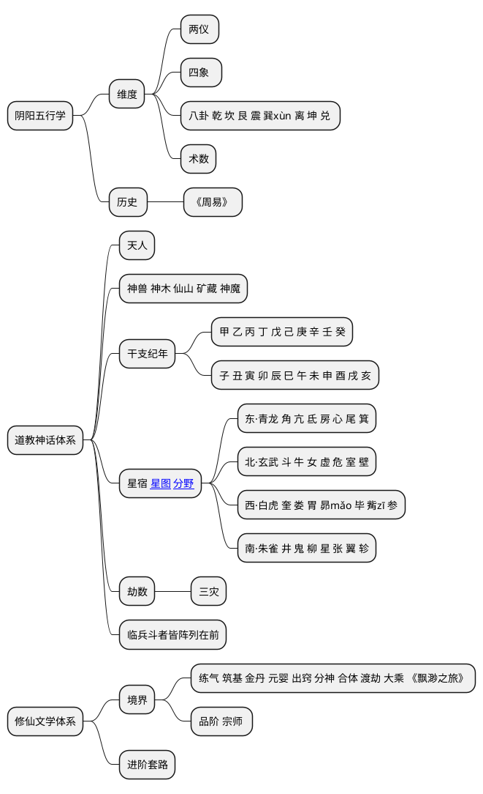

```plantuml
@startmindmap
* 阴阳五行学
    ** 维度
        *** 两仪 
        *** 四象  
        *** 八卦 乾 坎 艮 震 巽xùn 离 坤 兑 
        *** 术数
    
    ** 历史 
        *** 《周易》 
* 道教神话体系
    ** 天人
    ** 神兽 神木 仙山 矿藏 神魔
    ** 干支纪年
        *** 甲 乙 丙 丁 戊 己 庚 辛 壬 癸
        *** 子 丑 寅 卯 辰 巳 午 未 申 酉 戌 亥
    ** 星宿 [[https://zhuanlan.zhihu.com/p/582989560 星图]] [[https://zhidao.baidu.com/question/451326733.html?fr=search&word=%D0%C7%CB%DE%B7%D6%D2%B0+%BB%F9%D3%DA&ie=gbk 分野]]
        *** 东·青龙 角 亢 氐 房 心 尾 箕
        *** 北·玄武 斗 牛 女 虚 危 室 壁
        *** 西·白虎 奎 娄 胃 昴mǎo 毕 觜zī 参
        *** 南·朱雀 井 鬼 柳 星 张 翼 轸
    ** 劫数
        *** 三灾
    ** 临兵斗者皆阵列在前
* 修仙文学体系
    ** 境界
        *** 练气 筑基 金丹 元婴 出窍 分神 合体 渡劫 大乘 《飘渺之旅》
        *** 品阶 宗师 
    ** 进阶套路
         

@endmindmap
```