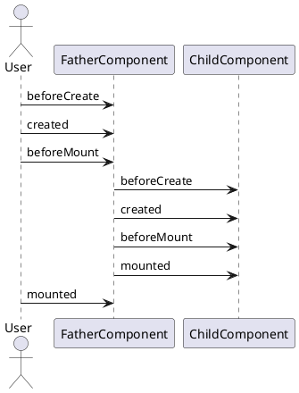

#### 程序入口
```
// main.js
import Vue from 'vue'
import App from './App.vue'

// 生产环境中不提示 正在使用开发板警告
Vue.config.productionTip = false

new Vue({
  render: h => h(App),
}).$mount('#app')

```
h 是 createElement 的别名
$mount('#app') 表示将该组件挂在到id="app"的dom上，这个#app在public/index.html上
#### provider & inject
类似于React的 Context Provider, 避免父组件向孙子后代组件传参时逐层引用，而以依赖注入的形式暴露给其他组件
```
const app = Vue.createApp({})

app.component('todo-list', {
  data() {
    return {
      todos: ['Feed a cat', 'Buy tickets']
    }
  },
  provide: {
    user: 'John Doe'
  },
  template: `
    <div>
      {{ todos.length }}
      <!-- 模板的其余部分 -->
    </div>
  `
})

app.component('todo-list-statistics', {
  inject: ['user'],
  created() {
    console.log(`Injected property: ${this.user}` // > 注入的 property: John Doe
  }
})
```
注意 provide 组件实例property，需要用返回函数的形式
```
provide() {
    return {
        todoLength: this.todos.length
    }
}
```
#### 生命周期
+ created vs mounted
+ beforeUpdete updated
+ beforeDestroy destroyed
+ activated deactivated (only for keep-alive)



#### 组件通信
+ props/$emit
+ event bus
+ vuex
+ provide/inject
+ ref 由生命周期图示可知 获取子组件引用必须要在mounted后
+ $parent $children jquery的回忆浮现脑海
+ attrs/listeners 


#### Options API vs Composition API
 指的是生命周期的选项 类似React class组件中‘选择’恰当的生命周期钩子嵌入业务逻辑。 created, mounted 等生命周期钩子，直接对应 componentDidMount, componentDidUpdate 等

Composition API则React function组件中的hooks

ref() 和 reactive() 对应 useState。
computed() 对应 useMemo。
onMounted -> useEffect(..., [])
onUpdated -> useEffect(..., [...]) (不指定依赖)
onUnmounted -> useEffect(() => { return () => { ... } }, [])
#### 组合式函数
defineProperty
#### 自定义指令

defineConponent

#### vue.config.js
vue cli 项目配置包含项目基本配置和对webpack的封装

基本配置：
+ 构建路径如 publicPath outputDir indexPath
+ 构建设置 transpileDependencies(false to disable sourcemap) ...
+ devServer 配置[webpack-dev-server选项](https://webpack.js.org/configuration/dev-server/) 包括 host proxy等
```
module.exports = defineConfig({
  transpileDependencies: true,
  devServer: {
    port: 8081,
    headers: {
      // 微前端需要跨域
      'Access-Control-Allow-Origin': '*'
    }
  },
  configureWebpack: {
    output: {
      library: `${packageName}-[name]`,
      libraryTarget: 'umd',
      chunkLoadingGlobal: `webpackJsonp_${packageName}`,
    }
  }
})
```
webpack配置:
调整 webpack 配置最简单的方式就是在 vue.config.js 中的 configureWebpack 选项提供一个对象 该对象将会被 webpack-merge 合并入最终的 webpack 配置 (注意与vue.config.js重叠的配置项会被vue.config.js覆盖)