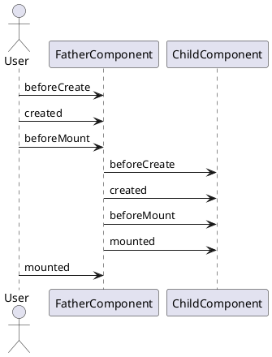

#### 程序入口
```
// main.js
import Vue from 'vue'
import App from './App.vue'

// 生产环境中不提示 正在使用开发板警告
Vue.config.productionTip = false

new Vue({
  render: h => h(App),
}).$mount('#app')

```
h 是 createElement 的别名
$mount('#app') 表示将该组件挂在到id="app"的dom上，这个#app在public/index.html上
#### provider & inject
类似于React的 Context Provider, 避免父组件向孙子后代组件传参时逐层引用，而以依赖注入的形式暴露给其他组件
```
const app = Vue.createApp({})

app.component('todo-list', {
  data() {
    return {
      todos: ['Feed a cat', 'Buy tickets']
    }
  },
  provide: {
    user: 'John Doe'
  },
  template: `
    <div>
      {{ todos.length }}
      <!-- 模板的其余部分 -->
    </div>
  `
})

app.component('todo-list-statistics', {
  inject: ['user'],
  created() {
    console.log(`Injected property: ${this.user}` // > 注入的 property: John Doe
  }
})
```
注意 provide 组件实例property，需要用返回函数的形式
```
provide() {
    return {
        todoLength: this.todos.length
    }
}
```
#### 生命周期
+ created vs mounted
+ beforeUpdete updated
+ beforeDestroy destroyed
+ activated deactivated (only for keep-alive)


```plantuml
@startuml
actor User

User -> FatherComponent: beforeCreate
User -> FatherComponent: created
User -> FatherComponent: beforeMount

FatherComponent -> ChildComponent: beforeCreate
FatherComponent -> ChildComponent: created
FatherComponent -> ChildComponent: beforeMount
FatherComponent -> ChildComponent: mounted

User -> FatherComponent: mounted

@enduml

```

#### 组件通信
+ props/$emit
+ event bus
+ vuex
+ provide/inject
+ ref 由生命周期图示可知 获取子组件引用必须要在mounted后
+ $parent $children jquery的回忆浮现脑海
+ attrs/listeners 


#### Options API vs Composition API
 指的是生命周期的选项 类似React class组件中‘选择’恰当的生命周期钩子嵌入业务逻辑。 created, mounted 等生命周期钩子，直接对应 componentDidMount, componentDidUpdate 等

Composition API则React function组件中的hooks

ref() 和 reactive() 对应 useState。
computed() 对应 useMemo。
onMounted -> useEffect(..., [])
onUpdated -> useEffect(..., [...]) (不指定依赖)
onUnmounted -> useEffect(() => { return () => { ... } }, [])
#### 组合式函数
defineProperty
#### 自定义指令

defineConponent

#### vue.config.js
vue cli 项目配置包含项目基本配置和对webpack的封装

基本配置：
+ 构建路径如 publicPath outputDir indexPath
+ 构建设置 transpileDependencies(false to disable sourcemap) ...
+ devServer 配置[webpack-dev-server选项](https://webpack.js.org/configuration/dev-server/) 包括 host proxy等
```
module.exports = defineConfig({
  transpileDependencies: true,
  devServer: {
    port: 8081,
    headers: {
      // 微前端需要跨域
      'Access-Control-Allow-Origin': '*'
    }
  },
  configureWebpack: {
    output: {
      library: `${packageName}-[name]`,
      libraryTarget: 'umd',
      chunkLoadingGlobal: `webpackJsonp_${packageName}`,
    }
  }
})
```
webpack配置:
调整 webpack 配置最简单的方式就是在 vue.config.js 中的 configureWebpack 选项提供一个对象 该对象将会被 webpack-merge 合并入最终的 webpack 配置 (注意与vue.config.js重叠的配置项会被vue.config.js覆盖)

<!-- interview-supplement-start -->
## 面试补充（2026-07-22）

> 本节为后续补充，用于资深软件工程师基础面试复习；上文保留原始笔记。上文用 React Hooks 类比 Composition API 便于入门，但两者的响应式模型、依赖声明和更新机制并不等价。

### 先建立 Vue 3 的运行模型

回答 Vue 原理问题时，可以先建立一条完整链路：

1. 模板由编译器转换为渲染函数，并附带静态提升、Patch Flag 等优化信息。
2. 组件渲染函数执行时读取响应式数据，Vue 将当前渲染 effect 记录为这些数据的依赖。
3. 写入响应式数据会触发相关 effect，但组件更新通常先进入调度队列，同一轮同步修改会被去重和批处理。
4. 更新阶段生成新的虚拟节点树，renderer 根据新旧节点的类型、`key` 和编译器提示执行 patch，最终修改必要的 DOM。

所以“数据变化就重新渲染整个页面”并不准确。变化触发的是依赖该数据的 effect；组件可能重新执行渲染函数，但真实 DOM 只提交比较后需要变更的部分。

### `ref`、`reactive` 与解构边界

- `ref(value)` 用带 `.value` 的对象保存值，适合基本类型、需要整体替换的对象以及 composable 的返回值。
- `reactive(object)` 返回 Proxy，适合围绕同一对象组织多个相关字段。它依赖代理访问完成追踪，不能替换成一个全新的普通对象后还期待原引用继续响应。
- 模板会自动解包常见位置上的 ref；JavaScript 中仍要显式访问 `.value`。
- 直接解构 `reactive` 对象得到的是当前属性值，后续读取不再经过原 Proxy。可用 `toRef()` 或 `toRefs()` 保留属性级响应性。
- 对大型第三方对象、Three.js 场景对象或采用不可变更新的数据，先判断是否真的需要深层代理；`shallowRef()`、`markRaw()` 有时比默认深响应更合适。

```ts
import { reactive, toRefs, watchEffect } from 'vue'

const state = reactive({ online: 0, alarm: 0 })
const { online, alarm } = toRefs(state)

watchEffect(() => {
  console.log(`online=${online.value}, alarm=${alarm.value}`)
})

state.online += 1
```

这里的 `online`、`alarm` 是指向原对象属性的 ref。若写成 `const { online } = state`，得到的只是解构当时的数字。

### `computed`、`watch` 与 `watchEffect`

| API | 主要职责 | 选择依据 |
| --- | --- | --- |
| `computed` | 声明有缓存的派生状态 | 结果可以由其他响应式状态纯计算得到 |
| `watch` | 监听明确的数据源并执行副作用 | 需要新旧值、精确控制触发源或控制执行时机 |
| `watchEffect` | 自动收集同步执行阶段读取的依赖 | 副作用依赖较直观，希望立即运行且不想重复列依赖 |

不要用 `watch` 维护本可由 `computed` 得到的第二份状态，否则容易产生同步顺序和一致性问题。异步监听还要处理过期请求：在回调中注册 cleanup，取消旧请求或让旧响应失效，避免后发请求被先发请求的迟到结果覆盖。

```ts
watch(deviceId, async (id, _oldId, onCleanup) => {
  const controller = new AbortController()
  onCleanup(() => controller.abort())

  const response = await fetch(`/api/devices/${id}`, {
    signal: controller.signal
  })
  device.value = await response.json()
})
```

### 从模板到 DOM 更新

Vue 3 并非只依靠运行时逐节点比较。编译器可以识别静态节点和动态绑定，运行时据此减少不必要的比较。理解这一点比背诵某个 diff 实现细节更重要。

连续的同步状态修改通常会被批量处理：

```ts
count.value += 1
count.value += 1
// 此处响应式值已是新值，但依赖它的 DOM 通常还在等待本轮队列刷新。
await nextTick()
// 此处可以读取本次 Vue 更新后的 DOM。
```

`nextTick()` 的含义是等待当前 Vue 更新队列刷新，不是通用延时器，也不保证图片加载、网络请求、浏览器绘制或第三方库的异步任务已经完成。

### `key` 表达的是节点身份

`key` 首先回答“新旧两次渲染中的节点是不是同一个实体”。稳定、唯一并来自业务实体的 `key`，可以让 Vue 正确复用或销毁组件实例和 DOM 状态。

用数组下标作为会插入、删除或重排列表的 `key`，可能让输入框状态、组件局部状态和实体错位。刻意改变组件 `key` 则可要求 Vue 销毁旧实例并创建新实例，但不应把它当作掩盖状态设计问题的常规刷新手段。

因此，“`key` 只是为了提升 diff 性能”是不完整的回答；正确性和状态身份比性能更先。

### 组件通信也是边界设计

- props 是父组件到子组件的只读输入；子组件通过 emit 表达事件，不应直接修改父级拥有的状态。
- 插槽把内容结构的控制权留给父组件，适合可复用容器和布局能力。
- `provide/inject` 适合跨层提供稳定依赖，例如表单上下文、主题或领域服务；它不是所有共享状态的默认替代品。
- composable 复用的是有状态逻辑。每次调用是否共享状态取决于状态定义在函数内部还是模块作用域，不能仅凭 `useXxx` 命名判断。
- 全局状态应保存跨页面、跨组件且具有明确生命周期的业务状态；临时表单输入和局部 UI 状态通常仍应就近管理。

资深工程师还应说明组件边界：输入输出是否清晰、状态由谁拥有、副作用在哪里释放、组件能否独立测试，以及领域状态是否被 UI 框架细节绑死。

### 高频数据与大列表的性能诊断

假设工业状态看板持续接收数千台设备的遥测，页面出现卡顿。不要一开始就回答“上虚拟列表”或“换 Web Worker”，而应分层定位：

1. 用 Vue Devtools、浏览器 Performance 和 Long Tasks 判断时间消耗在消息解析、响应式更新、组件渲染、布局还是绘制。
2. 区分数据接收频率和人眼需要的 UI 刷新频率。例如遥测可按原频率入缓冲区，而界面按 100 至 250 ms 合并发布一次快照。
3. 批量修改状态，避免每条消息触发独立的派生计算；稳定对象身份，减少无意义的 props 变化。
4. 对只读快照或大型外部对象考虑 `shallowRef()`；不要为了“响应式”深代理整棵设备对象图。
5. 列表确实很大且 DOM 成本占主导时再使用虚拟滚动；图表和 3D 场景也应控制绘制频率和对象分配。
6. JSON 解码、几何计算或数据聚合确实占用主线程时，再评估 Web Worker，并计入序列化和线程通信成本。

这类回答体现的是测量、分层和取舍，而不是背出更多 Vue API。

### 常见追问与回答边界

**为什么修改状态后马上读取 DOM 还是旧值？**

响应式值已同步改变，但组件 DOM 更新被调度和批处理。需要读取 Vue 本轮提交后的 DOM 时使用 `await nextTick()`。

**`reactive` 和 `ref` 哪个性能更好？**

通常不应先按微小性能差异选择。应先看状态形态、是否整体替换、是否需要解构和 composable API 的稳定性；大型数据再结合测量选择浅响应或原始对象。

**为什么不能在子组件里直接修改 prop？**

prop 的所有权属于父组件。子组件修改会破坏单向数据流，并可能在父组件重新渲染时被覆盖。可通过 emit 请求父级更新，或在边界清晰时使用 `v-model` 协议。

**Composition API 是否天然比 Options API 更快？**

二者主要是代码组织方式，不应笼统宣称 Composition API 运行更快。Composition API 的主要价值是按业务关注点组合逻辑、增强类型推导和逻辑复用；性能仍取决于实际依赖、渲染和数据结构。

<!-- interview-supplement-end -->
