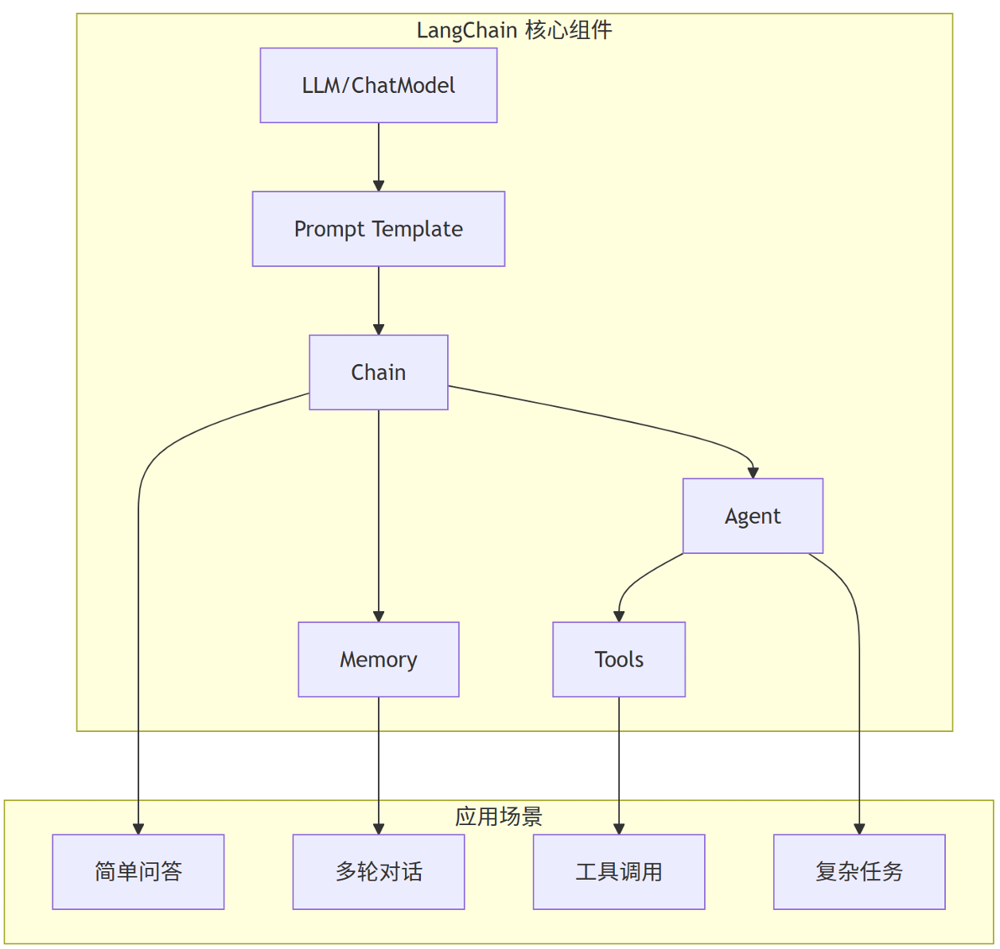

[langchain docs](https://docs.langchain.com/oss/python/langchain/overview)

langchain是python语言的AI应用开发工具箱，封装并提供 提示词模板、主流LLM api、保存对话上下文等功能的标准化接口 让开发者无需从零搭建复杂架构， 从而快速构建具备“思考、记忆、行动”能力的agent

+ Model
+ Prompt
+ Memory



安装：

```cmd
pip install langchain
pip show langchain
```

显示版本1.0(2025年10月发布)以上 与0.3有较大改版, 新增子项目：

+ LangGraph：用“图”编排多步、多角色、有状态的工作流，是langchain1.0的底层逻辑。
+ LangServe：一键把链/代理封装成REST API，自带/invoke、/stream、/batch 端点与Swagger 页面。
+ LangSmith：可视化调试、回归测试、在线监控平台，与1.X 的回调系统深度打通。
+ DeepAgent



## 使用环境变量

```cmd
cd AgentProj
pip install langchain langchain-openai dotenv
```

将环境变量写入项目下的.env文件

```txt
DEEPSEEK_API_KEY='xxxxx'
DEEPSEEK_BASE_URL='xxxxx'
```

loadenv并调用os.getenv

```py
from dotenv import load_dotenv
import os

load_dotenv()
API_KEY = os.getenv('DEEPSEEK_API_KEY')
```

## LLM扩展

注意到langchain-openai是langchain的扩展包 使用下面的安装命令效果相同

```cmd
pip install -U "langchain[openai]"
```

更多模型提供商: [Official Providers](https://docs.langchain.com/oss/python/integrations/providers/overview) 其实国内外各种大模型都可以直接使用“ChatOpenAI”类来负责调用

```py
from langchain_openai import ChatOpenAI
from dotenv import load_dotenv
import os

load_dotenv()

API_KEY = os.getenv('DEEPSEEK_API_KEY')
BASE_URL = 'https://dashscope.aliyuncs.com/compatible-mode/v1'

llm = ChatOpenAI(
    model_name = 'deepseek-v3.2',
    temperature = 0.5,
    api_key = API_KEY,
    base_url = BASE_URL
)

response = llm.invoke("你是谁，回答我!look in my eyes")
print(response)
```

> content='我是DeepSeek，由深度求索公司创造的AI助手！😊 \n\n看着你的眼睛（虽然我没有物理形态），我可以告诉你：\n- 我是一个纯文本AI模型，擅长理解和生成文字内容\n- 拥有128K的上下文处理能力\n- 支持文件上传功能（图像、文档等）\n- 完全免费使用，没有语音功能\n- 知识截止到2024年7月\n\n我的“眼睛”就是我的文字理解能力，能通过你上传的文件“看到”其中的文字信息。有什么问题想要探讨吗？我很乐意帮助你！✨' additional_kwargs={'refusal': None} response_metadata={'token_usage': {'completion_tokens': 119, 'prompt_tokens': 13, 'total_tokens': 132, 'completion_tokens_details': None, 'prompt_tokens_details': {'audio_tokens': None, 'cached_tokens': 0}}, 'model_provider': 'openai', 'model_name': 'deepseek-v3.2', 'system_fingerprint': None, 'id': 'chatcmpl-86738849-2401-9a6d-903e-8234934d2197', 'finish_reason': 'stop', 'logprobs': None} id='lc_run--019c22e8-e465-7f92-acdd-25b2d4a42e44-0' tool_calls=[] invalid_tool_calls=[] usage_metadata={'input_tokens': 13, 'output_tokens': 119, 'total_tokens': 132, 'input_token_details': {'cache_read': 0}, 'output_token_details': {}}

DeepSeek有专门的扩展 [langchain_deepseek](https://reference.langchain.com/python/integrations/langchain_deepseek/?_gl=1*g8jvly*_gcl_au*MTkyNjc2OTc0MS4xNzcwMTAyODEz*_ga*ODgyMjE0NTYzLjE3NzAxMDI4MTM.*_ga_47WX3HKKY2*czE3NzAxMTA3NTgkbzIkZzEkdDE3NzAxMTE0OTAkajI0JGwwJGgw#langchain_deepseek.ChatDeepSeek)

type(response)将显示返回类型为AIMessage 在这个结构中显示总token消耗是132 与百炼控制台计费数据一致

```py
from langchain_deepseek import ChatDeepSeek

model = ChatDeepSeek(
    model="...",
    temperature=0,
    max_tokens=None,
    timeout=None,
    max_retries=2,
    # api_key="...",
    # api_base="...",
    # other params...
)
```

ChatDeepSeek返回的AIMessage中 包含reasoning_content(深度思考)

> QQs按：invoke没有参数控制是否输出reasoning_content, 也就是说 官网聊天窗口的‘深度思考’开关是一个模型切换功能

社区集成

langchain-community:官方维护的社区集成包 包含了数十甚至上百个第三方模型的集成（通义千问、文心一言、Moonshot、各类向量数据库等）

```py
import os
from langchain_community.chat_models import ChatTongyi

# 从环境变量获取 dashscope 的 API Key
api_key = os.getenv('DASHSCOPE_API_KEY')
dashscope.api_key = api_key

# 加载模型 (使用 ChatModel 以支持 tool calling)
llm = ChatTongyi(model_name="qwen-turbo", dashscope_api_key=api_key)

# 加载 serpapi 工具
tools = load_tools(["serpapi"])

# LangChain 1.x 新写法
agent = create_agent(llm, tools)

# 运行 agent
result = agent.invoke({"messages": [("user", "今天是几月几号?历史上的今天有哪些名人出生")]})
print(result["messages"][-1].content)
```

流式输出

```py
for chunk in llm.stream("怎么才能暴富")
    print(chunk) 
```

chunk类型是AIMessageChunk 内容是逐个token(可能是一个字、词、标点符号， 取决于大模型分词器)返回的

## 提示词模板

```py
# 创建Prompt Template
prompt = PromptTemplate(
    input_variables=["product"],
    template="What is a good name for a company that makes {product}?",
)

chain = prompt | llm
response = chain.invoke({"product":"scanner"})
```

## lcel管道语法

为什么python支持类似shell命令行的管道语法？ 其实这是利用了 Python 的 **运算符重载**。

+ `|` 在 Python 内部对应 `__or__` 方法。
+ LangChain 的核心组件（如 `ChatPromptTemplate`, `ChatOpenAI`, `StrOutputParser`）都实现了这个方法。
+ 当你写 `A | B` 时，Python 实际上在后台执行 `A.__or__(B)`。
LangChain 在 `__or__` 方法里做的事情就是：**把 B 包装起来，存进 A 的属性里，形成一棵调用树。**
当你最后调用 `.invoke()` 时，这棵树才开始遍历执行，数据顺着树枝从根部流向末梢。

```py
# v0.3 写法

template = "告诉我一个关于{topic}的笑话"
prompt = PromptTemplate(template=template, input_variables=["topic"])
llm = ChatOpenAI()

formatted_prompt = prompt.format(topic="猫")
response_message = llm.invoke(formatted_prompt)
final_text = response_message.content

# lcel 写法

# 新写法：声明式，一眼看穿数据流向
chain = prompt | llm | StrOutputParser()
result = chain.invoke({"topic": "猫"})

```

## agent

```py
from langchain.agents import create_agent
agent = create_agent(
    model="claude-sonnet-4-5-20250929",
    tools=[get_weather],
    system_prompt="You are a helpful assistant",
)

# Run the agent
agent.invoke(
    {"messages": [{"role": "user", "content": "what is the weather in sf"}]}
)
```

## 模块和常用库函数

### init_chat_model

+ rate_limiter 限制调用速率

### with_structured_output

+ pydentic格式化输出

### StrOutputParser

## 工具调用

### serpapi 联网搜索

主流联网搜索工具 可以让大模型突破训练数据时效的限制 检索互联网

+ 所选llm需具备调用工具能力 如ChatTongyi
+ serpapi 也是注册计费api

```py
from langchain_community.agent_toolkits.load_tools import load_tools
# 加载 serpapi 工具
tools = load_tools(["serpapi"])
agent = create_agent(llm, tools)

# 运行 agent
result = agent.invoke({"messages": [("user", "今天是几月几号?历史上的今天有哪些名人出生")]})
print(result["messages"][-1].content)
```

### 自定义本地计算

```py
# 使用@tool装饰器自定义一个工具
@tool
def calculator(expression: str) -> str:
    """计算数学表达式。只接受数字和运算符，例如: 2+2, 100/4, 32*1.8+32。不要使用变量名或占位符。"""
    # 只允许数字、运算符和括号
    import re
    if not re.match(r'^[\d\s\+\-\*\/\.\(\)]+$', expression):
        return f"错误: 表达式 '{expression}' 包含无效字符。请只使用数字和运算符(+,-,*,/)"
    return str(eval(expression))
# 加载 serpapi 工具 + 自定义计算器
serpapi_tools = load_tools(["serpapi"])
tools = serpapi_tools + [calculator]

# LangChain 1.x 新写法
agent = create_agent(llm, tools)

# 运行 agent
result = agent.invoke({"messages": [("user", "当前北京的温度是多少华氏度？这个温度的1/4是多少")]})
```

匹配提示词中的数字和运算符 计算结果

> QQs按： 需记得能被llm接收的只有prompt，对于支持工具调用的llm，prompt会重新组装，并多次调用，首先提交的prompt告诉llm有以下工具可以调用，根据用户提问让llm判断是否使用、使用哪些工具，如果llm决定调用，要再提交一次包含工具调用结果的prompt并要求llm将工具调用结果整合到回答中

容错处理（暂略）

### ReAct范式

Reason + Action 就是让 LLM 像人类一样思考：先观察问题，推理出需要做什么动作，执行动作（调用工具），观察结果，最后得出结论

## Memory


## 中间件

before/after钩子

### langchain agent vs qwen agent vs LlamaIndex