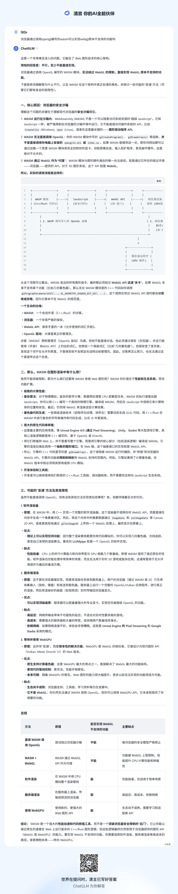

title: Wasm OpenGL项目
date: 2025-08-06 17:16:14
tags:
- webassembly
- OpenGL
- 性能优化
---
(windows)
```
git clone https://github.com/emscripten-core/emsdk.git
cd emsdk

git pull
# need google access
./emsdk.bat install latest
./emsdk.bat activate latest

cd ..
git clone https://github.com/microsoft/vcpkg.git
cd vcpkg

.\bootstrap-vcpkg.bat

# add vcpkg directory into env variable path

cd ../Workspace/WasmOpenGLProject
vcpkg install boost:wasm32-emscripten 

vcpkg install glm:wasm32-emscripten

vcpkg install glad:wasm32-emscripten
```
> issues error: building openssl:wasm32-emscripten failed with: BUILD_FAILED

查看了\vcpkg\buildtrees\openssl\install-wasm32-emscripten-dbg-err.log 内容是 
```
Trying to rename Makefile-333 -> Makefile: Permission denied
make[1]: *** [Makefile:2395: depend] Error 13
make: *** [Makefile:2293: build_modules] Error 2
make: *** Waiting for unfinished jobs....
```
怀疑其他线程访问导致写入失败
```
set VCPKG_MAX_CONCURRENCY=1
vcpkg install openssl:wasm32-emscripten --clean-after-build
```

> The ``FindBoost`` module is removed.

cmake 3.30 起移除了FindBoost模块 导致找不到BOOST_DIR Boost_FILESYSTEM_LIBRARY_DEBUG Boost_INCLUDE_DIR等， 实际上面的步骤中相关包已成功安装在D:\Workspace\Github\vcpkg\installed\wasm32-emscripten\include

make Ninja project
```
mkdir build
cd build
emcmake cmake -G "Ninja" ^
    -DCMAKE_SYSTEM_NAME=Emscripten ^
    -DCMAKE_SYSTEM_PROCESSOR=x86 ^
    -DCMAKE_TOOLCHAIN_FILE="%VCPKG_HUGE%/scripts/buildsystems/vcpkg.cmake" ^
    -DVCPKG_CHAINLOAD_TOOLCHAIN_FILE="%EMSDK%/upstream/emscripten/cmake/Modules/Platform/Emscripten.cmake" ^
    -DVCPKG_TARGET_TRIPLET=wasm32-emscripten ^
    -DCMAKE_C_COMPILER="%EMCC_PATH%" ^
    -DCMAKE_CXX_COMPILER="%EMXX_PATH%" ^
    -DCMAKE_BUILD_TYPE=Release ^
    -DCMAKE_FIND_ROOT_PATH_MODE_PACKAGE=BOTH ^
    -DCMAKE_PREFIX_PATH="%VCPKG_HUGE%/installed/wasm32-emscripten" ^
    ..
cd ..
```
build wasm
```
cd build
emmake ninja
```

