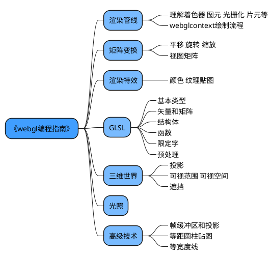
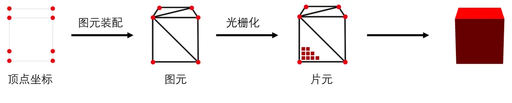

#### RoadMap
[webgl学习路线](https://juejin.cn/post/7383894634156130313?searchId=20240703103839DF2909CC9BD7E7EF9519)



#### 目标导向
keyWords: 渲染引擎开发 shader设计优化
#### 三维模型的平面投影————矩阵运算
[图解webgl](https://juejin.im/entry/58fdb9b544d9040069ef2488)

渲染管线

其中所谓光栅化 我理解是屏幕光栅 将矢量图形映射到有限分辨率的屏幕像素上 每个像素通过片元着色器绘制
#### WebGLRenderingContext
获取webgl并调用webgl接口设置渲染背景色
```
const canvas = document.getElementById('webgl');
// if webgl context isnot exist, init it 
const webgl = canvas.getContext('webgl');

// Set clear color to black, fully opaque
webgl.clearColor(0.0, 0.0, 0.0, 1.0);
// Clear the color buffer with specified clear color
webgl.clear(webgl.COLOR_BUFFER_BIT);
```
color 是float 0.0~1.0 映射 0~255<br>
颜色缓冲区（COLOR_BUFFER_BIT），其他还有深度缓冲区（DEPTH_BUFFER_BIT）模板参数缓冲区（STENCIL_BUFFER_BIT）参考 [官方标准](www.khronos.org)

#### 着色器
着色器是使用 GLSL(OpenGL ES Shading Language)编写的程序，它携带着绘制形状的顶点信息以及构造绘制在屏幕上像素的所需数据，换句话说，它负责记录着像素点的位置和颜色。<br>
顶点着色器（Programmable Vertex Processor）和 片元着色器（Programmable Fragment Processor）

[WebAPI: WebGLRenderingContext.shaderSource](https://developer.mozilla.org/zh-CN/docs/Web/API/WebGLRenderingContext/shaderSource)设置着色器源码，参数分别是着色器变量，和源码字符串
```
const vertexShaderSource = `
    void main(){
        gl_Position=vec4(0.0,0.0,0.0,1.0);
        gl_PointSize=100.0; //这里写100就会报错！
    }
`;
const fragmentShaderSource = `
    void main(){
        gl_FragColor=vec4(1.0,1.0,0.0,1.0);
    }
` 
```
GLSL非常严格，函数分号的缺失、甚至浮点数写成整型都可能在后面调用WebGLProgram时报错 变量名也是GLSL定义死的不可更改
> WebGL: INVALID_OPERATION: useProgram: program not valid
#### 着色器函数
```
const initShader = (gl: WebGLRenderingContext )=>{
    // 创建程序对象
    const program = gl.createProgram();
    if(program){
        // 创建着色器对象
        const vertexShader = loadShader(gl, gl.VERTEX_SHADER, vertexShaderSource)
        const fragmentShader = loadShader(gl, gl.FRAGMENT_SHADER, fragmentShaderSource)
        // 附加着色器到程序
        gl.attachShader(program, vertexShader!)
        gl.attachShader(program, fragmentShader!)
        // 链接webgl上下文对象和程序对象
        gl.linkProgram(program)
        if (!gl.getProgramParameter(program, gl.LINK_STATUS)) {
            alert(
              "无法初始化着色器程序: " +
              gl.getProgramInfoLog(program),
            );
            return null;
          }
        // 启动程序对象
        gl.useProgram(program)
    }
    
}

const loadShader = (gl: WebGLRenderingContext, type:number, source: string)=>{
    const shader = gl.createShader(type)
    if(!shader) return null
    gl.shaderSource(shader, source)
    gl.compileShader(shader)
    if (!gl.getShaderParameter(shader, gl.COMPILE_STATUS)) {
        alert(
        "编译着色器时出错：" + gl.getShaderInfoLog(shader),
        );
        gl.deleteShader(shader);
        return null;
      }
    return shader
}
```
使用上述着色器绘制点
```
initShader(webgl)
webgl.drawArrays(webgl.POINTS, 0, 1)
```

#### vertex shader attribute
声明attribute变量
```
const vertexShaderSource = `
    attribute vec4 a_Position;
    void main(){
        gl_Position=a_Position;
        gl_PointSize=100.0;
    }
`;
```
获取attribute变量指针, 这里的a_Position是个number类型的常量，通过webgl接口可以访问到它‘指向’的shader中的attribute
```
const a_Position = webgl!.getAttribLocation(webglProgram, 'a_Position')
webgl!.vertexAttrib3f(a_Position, 0.0, 0.5, 0.0);
```
webgl提供了一系列修改顶点着色器attribute同族方法 用于设置不同数量的分量 [vertexAttrib[1234]f[v]] 其中f指浮点数(https://developer.mozilla.org/zh-CN/docs/Web/API/WebGLRenderingContext/vertexAttrib)
v是vector值 类型为Float32Array 如
```
vertexAttrib3fv(index, value)
```
#### fragment shader uniform
相应的片元着色器中是uniform变量 对于片元着色器有特殊要求指明浮点数精度
```
const fragmentShaderSource = `
    precision mediump float; //中等精度浮点数
    uniform vec4 u__FragColor; 
    void main(){
        gl_FragColor=u__FragColor;
    }
` 
const u__FragColor = webgl.getUniformLocation(webgl.program,'u__FragColor');
webgl.uniform4f(u__FragColor, 1.0,1.0,0.0,1.0)
```
> attribute 变量用于在顶点着色器中从应用程序（如OpenGL程序）传递逐顶点数据。每个顶点可以有不同的值，因此 attribute 变量通常用于传递顶点的位置、法线、纹理坐标、颜色等数据。

使用场景：
+ 当你需要为每个顶点提供特定的数据时。
+ 当数据需要随着每个顶点变化时。
> uniform 变量用于在顶点着色器和片段着色器之间传递数据，或者从应用程序传递到着色器程序。uniform 变量的值在整个绘制调用中是恒定的，不会随着顶点的变化而变化。

使用场景：
+ 当你需要传递一些在整个绘制调用中保持不变的数据时。
+ 当数据需要在顶点着色器和片段着色器之间共享时。

#### 补间动画
补间动画在两关键帧之间插值而得。

#### 多点数据

#### 标量 向量 张量
+ 标量 scalar
+ 向量 vendor
+ 张量 tensor 与矢量相类似，定义由若干坐标系改变时满足一定坐标转化关系的有序数组成的集合为张量。

> 在二维空间里，二维二阶张量（平面应力张量）的每个方向都可以用二维空间两个方向表示。（区分2阶张量的2个方向，和二维空间的两个方向x，y）所以共有2^2=4个方向。
在三维空间里，三维二阶张量（空间应力张量）的每个方向都可以用三维空间三个方向表示。（区分2阶张量的2个方向，和三维空间的三个方向x，y、z）所以共有3^2=9个方向。[通俗理解张量tensor](https://www.jianshu.com/p/2a0f7f7735ad)

三维空间内的向量根据笛卡尔坐标系的x,y,z三个基向量分解为三个分量 故
$$v=\left[
 \begin{matrix}
   v_x \\
   v_y \\
   v_z 
  \end{matrix}
  \right]$$

而三维二阶张量，其物理含义是某点分解为三个两两正交的平面以及每个平面上的力（力是向量 其自有三个分量）3×3共9个分量

如视频截图 方块表示每个分量上的值(模值，标量)
$$t=\left[
 \begin{matrix}
   v_{xx} & v_{xy} & v_{xz} \\
   v_{yx} & v_{yy} & v_{xz} \\
   v_{zx} & v_{xy} & v_{zz} 
  \end{matrix}
  \right]$$
[应力张量](https://pencilq.com/38/)
[通俗地理解张量](https://www.zhihu.com/question/23720923/answer/32739132)

#### mesh polygon nurbs
mesh是曲面 在计算机三维处理中常以polygon(多边形)来实现
NURBS （Non-uniform rational basis spline非均匀有理基本样条）基于数学公式表达的曲面，但在计算机三维处理中实现 还是需要差值以及polygon

#### 浏览器支持
访问https://get.webgl.org测试当前浏览器是否支持webgl

#### interview
[面试题](https://juejin.cn/post/7236357619983269943?searchId=202505121118127716CD99F393F0CD681E)